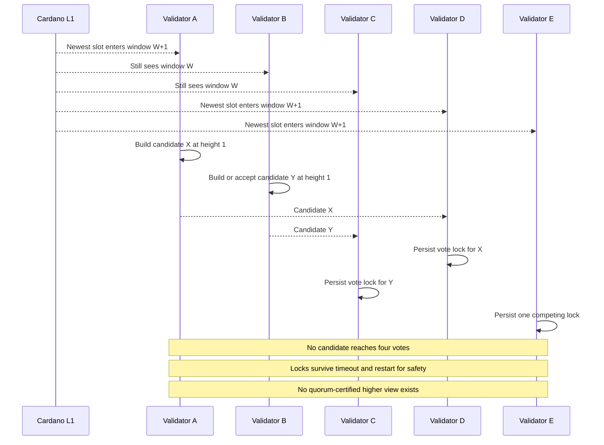
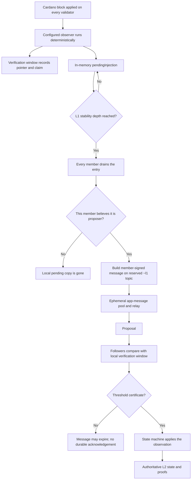
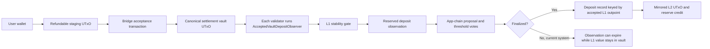
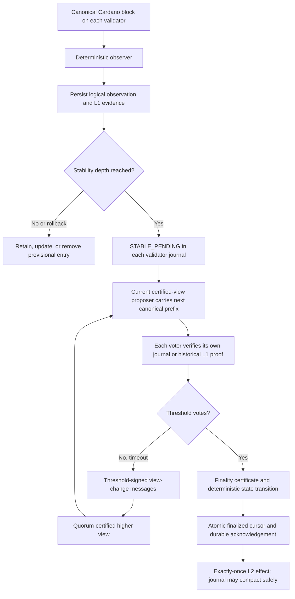

# ADR-041 — Trust-preserving L1 observation delivery and consensus recovery

- **Status:** Proposed
- **Date:** 2026-08-26
- **Owner:** Yano core protocol with Yano X observer, product, and deployment integration
- **Scope:** Recovery from app-chain consensus stalls without losing stable Cardano observations or
  introducing an operator, replay service, or external indexer as a new authority. The motivating
  case is the Yano X EUTxO payment-settlement chain, but the decision applies to every block-scoped
  `L1Observer` contribution.
- **Related:**
  [ADR-039 deployment automation](039-geographically-distributed-deployment-automation.md),
  [ADR-008.2 rotating sequencer][yano-adr-008-2],
  [ADR-008.4 script anchors and L1 observations][yano-adr-008-4],
  [ADR-027 L1 rollback and observation analysis][yano-adr-027],
  [EUTxO settlement ADR](app-layer/utxo/001-eutxo-state-machine-and-cardano-settlement.md),
  and [Yano issue 85](https://github.com/bloxbean/yano/issues/85).

## 1. Decision summary

Yano must treat consensus recovery and L1-observation delivery as one safety-sensitive protocol.
Restoring the ability to finalize a block is insufficient if the stable L1 fact that was waiting for
that block has already disappeared.

The target design combines:

1. a quorum-certified view-change protocol for fixed and rotating sequencing;
2. a bounded durable observation journal on every validator;
3. deterministic observation identity, ordering, inclusion, and finalization acknowledgement;
4. independently verified historical recovery when an observation predates the live verification
   window; and
5. operator commands that may trigger reconciliation but can never assert an L1 fact or supply an
   arbitrary `~l1/*` body.

This design introduces no new trusted party. Each voting validator must derive or cryptographically
verify an observation against its own canonical Cardano view. The existing app-chain threshold is
still the finality authority, but a threshold certificate is not a substitute for live L1
verification when introducing a new value-bearing observation.

The existing fixed-proposer deployment is an interim risk reduction only. The existing
`admin/unlock-stale-round` operation remains an authenticated, audited emergency escape hatch. It is
not automatic recovery and must never be coupled to raw observation injection.

## 2. The five-node incident

### 2.1 Deployment shape

The incident occurred in a production-like Cardano Preprod showcase using Yano `0.1.0-pre13`:

- five geographically distributed validators;
- a four-of-five finality threshold;
- public app-chain networking with a complete validator mesh;
- 13 hosted showcase chains;
- `sequencer.mode=rotating` with a 60-slot proposer window;
- Cardano Preprod synchronization on every validator;
- L1 anchoring; and
- an EUTxO payment chain with Cardano settlement and deposit observation.

Infrastructure addresses, transaction identifiers, credentials, and signing material are not
relevant to the failure and are intentionally omitted.

### 2.2 What was observed

The ordinary orders chain reached height 212. That was evidence that networking and consensus could
work in many rounds; it was not evidence that rotating recovery was safe under every proposer-window
race.

Two chains independently stalled while trying to finalize height 1:

- the payment-settlement chain; and
- the Cardano-history chain.

All five members reported a stale vote lock at height 1. Members had persisted votes for competing
block hashes, no candidate collected the four signatures required for finality, and no member stored
a finalized block or certificate at that height. Coordinated restarts correctly preserved the vote
locks.

During the payment-settlement stall, the validators saw a valid Cardano deposit to the configured
settlement vault. The observation reached the app-chain message path, but no app-chain block
finalized before the message expired. The Cardano value remained locked in the settlement vault,
while the corresponding L2 UTxO was never created.

The stale locks were later cleared through a guarded operator procedure only after verifying across
all five members that height 1 had not finalized. Consensus could run again, but the expired deposit
observation was no longer pending. Unlocking a vote lock does not replay an L1 fact.

### 2.3 Why rotation triggered the stall

The rotating scheduler uses each member's newest locally observed L1 slot as its clock. That avoids
trusting wall-clock time, but geographically separated nodes do not receive the newest Cardano block
at exactly the same moment. Around a proposer-window boundary, correct members can temporarily
calculate different current proposer views.

The protocol retains the essential safety invariant that a member signs at most one block per
height. A vote lock survives restart so that two conflicting finality certificates cannot be formed
by rebooting validators. However, the current lock is scoped to height and does not include a
quorum-certified higher view in which a safe replacement can be selected.

With a four-of-five threshold, competing proposals can split the finite vote budget so that neither
candidate can reach four votes. Propose-around can recover when enough validators remain unlocked,
but it cannot recover when several validators have spent their vote on conflicting candidates.
Timeout alone does not prove that voting for another block is safe.



This is a consensus-protocol limitation, not a firewall, peer-connectivity, or settlement-plugin
error. Increasing the rotation window can make the race less likely, but it cannot prove that it
will never occur.

### 2.4 Why the deposit did not return after unlock

The current block-scoped observation path keeps two different transient structures:

- a bounded verification window used by followers to compare proposed observations with their own
  L1 computation; and
- an in-memory `pendingInjection` map used until an observation becomes stability-deep.

At each L1 block, every member drains observations that have become stable. Only the member that
currently believes it is the scheduled proposer injects those observations into its app-message
pool. The other members also remove their stable entries during the drain, even though they do not
inject them.

Injection is best-effort. A full pool can drop an observation, restart loses the in-memory pending
map, and an injected app message remains subject to its normal TTL. There is no durable
observation-to-finality acknowledgement. Once a stalled round outlives the message, the original L1
block is not automatically processed again and a later deposit creates only a new observation.

The incident therefore combined two independent liveness gaps:

1. the app chain could not move to a safe new consensus view; and
2. the stable observation could not survive until a later successful view.

Fixing only one gap leaves the other one exposed.

## 3. Current generic L1-to-L2 flow

### 3.1 Observer activation

`L1Observer` and `L1ObserverProvider` are generic Yano plugin SPIs. An observer is selected through
the plugin catalog and configured per app chain under `observers.<id>.*`. The observer settings are
consensus-critical and must be identical on all validators.

Every validator runs the same observer over the fully parsed Cardano blocks in its own L1 stream.
An observer must be deterministic:

```text
(observer identity, observer configuration, slot, block hash, block bytes)
    -> identical ordered L1 observations
```

The framework turns each result into a canonical `L1Observation` containing an observer identity,
an L1 pointer, and an observer-defined claim. Its reserved topic is `~l1/<observer-id>`.

### 3.2 Stability and follower verification

An observation is not eligible for L2 immediately. It waits until its Cardano block is at least the
configured `l1.stability-depth` behind the local tip. The resulting app block also carries a stable
L1 reference.

Before voting for a live proposal, a follower checks the included observation against its own
observer output:

| Verdict | Meaning | Current live-proposal behavior |
|---|---|---|
| `OK` | Claim and block hash match the follower's recomputation | Vote may continue |
| `MISMATCH` | Claim, hash, or expected in-window observation differs | Reject |
| `AHEAD` | The follower has not reached the observation slot | Defer |
| `UNKNOWN` | The observation is older than the bounded local window | Accept because the chain vouches |

`UNKNOWN` is useful when applying already certified history during catch-up. It is not strong enough
for a new privileged historical replay of a value-bearing fact: in that case the requested fact has
not yet been certified, so accepting it because a future certificate might exist is circular.

### 3.3 Current flow diagram



### 3.4 What the existing flow gets right

The current design already has important safety properties that must be preserved:

- observers are deterministic plugins rather than trusted remote calls;
- every validator observes its own Cardano stream;
- L1 stability is checked before an irreversible L2 transition;
- a wrong in-window claim fails closed;
- a validator without the configured observer rejects the reserved observation;
- public message submission cannot target reserved `~l1/*` topics;
- app-chain finality still requires the configured validator threshold; and
- state-machine transitions and proofs remain deterministic after finality.

The problem is reliable delivery and recovery, not the decision to use deterministic follower-
verified observations.

## 4. Payment-settlement flow

### 4.1 L1 acceptance before L2 credit

The EUTxO bridge uses a two-stage deposit protocol. A user first creates a refundable staging output.
A bridge acceptance transaction then consumes the staging output into the canonical settlement
vault. The app chain must never credit the refundable staging output because the user could later
recover it on L1 after spending its L2 mirror.

The `eutxo-vault-deposit-v1` observer accepts only a transaction that creates the exact configured
vault output. It deterministically verifies and encodes at least:

- the payment-settlement chain ID;
- the accepted Cardano transaction and output index;
- the L1 slot and block hash;
- the configured vault address and script hash;
- the inline EUTxO vault datum;
- the intended L2 address and key binding;
- the deposit nonce and staging outpoint;
- the refund deadline and depositor key hash;
- lovelace-only value within the configured bound; and
- the canonical accepted and mirrored output bytes.

One acceptance transaction may create only one recognized deposit-vault output. Outputs with a
different address, script identity, chain ID, unsupported datum, non-lovelace value, or invalid
bounds are rejected rather than approximated.

### 4.2 Deterministic import

After the observation is finalized, the EUTxO state machine checks that the observation envelope,
transaction anchor, block pointer, chain identity, vault identity, and claim agree. It keys the
deposit record by the accepted L1 outpoint:

- replaying the identical claim is a deterministic no-op;
- binding the same L1 outpoint to different data is an error;
- a new mirrored L2 UTxO is created for the intended owner; and
- the lovelace reserve is increased atomically with the deposit record.

This exactly-once state transition is sound, but it does not make the transport from L1 observation
to finalized block reliable. State-level idempotency and delivery-level durability are separate
requirements.



The L1 anchor shown elsewhere in the product is a different direction of travel: it publishes an
L2 state commitment to Cardano. It does not deliver deposits into L2 and cannot recover an expired
deposit observation.

## 5. Generalized failure model

The payment deposit is the most visible example because real test ADA becomes unavailable, but the
same infrastructure carries any deterministic L1 fact:

- transaction metadata;
- payments to a watched address;
- EUTxO vault deposits;
- withdrawal confirmations;
- bridge-epoch or governance updates;
- protocol-parameter or epoch observations; and
- future plugin-defined facts.

For every observer, the system must distinguish four concerns:

1. **Truth:** did this exact fact occur on the canonical L1?
2. **Stability:** is it deep enough that irreversible L2 finality is acceptable?
3. **Delivery:** will it remain eligible until it is finalized exactly once?
4. **Ordering and completeness:** can a proposer omit or reorder required facts?

The current implementation is strongest on truth and stability for recent observations, but weak on
delivery, historical verification, and completeness.

Newer epoch-derived observation infrastructure has a separate durable
`GENERATING -> READY -> OFFERED -> FINALIZED` spool. That is a useful implementation precedent. The
specific loss demonstrated here is in the generic block-scoped `L1ObservationService` path; this ADR
does not claim that the epoch spool has the same ephemeral-queue defect. The truth, trust, ordering,
view-change, and historical-verification requirements still apply to both paths.

## 6. Infrastructure gaps and safety concerns

### 6.1 Consensus recovery has no certified higher view

Persistent one-vote-per-height locks protect safety, but timeouts do not create evidence that makes
a conflicting vote safe. A manual lock deletion intentionally overrides this invariant based on an
operator's external proof that no certificate exists.

That procedure is acceptable only as a last resort. Automating it on a timer would allow partitions
or delayed certificates to create conflicting finality.

### 6.2 Pending transaction observations are ephemeral

The generic block-observation queue is bounded and in memory. It is removed at stability-drain time,
not at app-chain finalization time. Process restart, pool backpressure, message expiry, or an extended
consensus stall can therefore lose delivery without invalidating the underlying L1 fact.

### 6.3 Stable delivery has no durable owner after drain

All members compute the fact, but all members discard their stable pending entry during the same
drain. When injection succeeds, peers can receive ephemeral relayed copies in their message pools,
but no member retains a durable obligation to carry the observation through expiry or view change.
A replacement proposer cannot retrieve the fact from a durable local source.

### 6.4 No observation acknowledgement is tied to finality

The framework does not persist a lifecycle such as `STABLE_PENDING -> IN_FLIGHT -> FINALIZED` for
block observations. It cannot distinguish:

- never injected;
- injected but not proposed;
- proposed in an uncertified view;
- finalized but not yet locally acknowledged; or
- safely removable.

### 6.5 Observation identity and envelope identity serve different purposes

Retries can create new member signatures, TTLs, and app-message IDs around the same logical L1 fact.
Deduplicating only app-message IDs is insufficient. The framework needs a stable logical observation
ID independent of any one proposer envelope.

### 6.6 Followers verify inclusion, not completeness

A follower rejects a bad observation that is included. It does not currently prove that the
proposer included every required stable observation. A fixed or rotating proposer can omit a fact;
rotation only changes who can censor and when.

### 6.7 Historical repair lacks a trust-preserving verification path

The live verification window is intentionally bounded. The generic historical `L1View` described by
earlier ADRs has not shipped, and a public/admin endpoint cannot rerun an observer against a pinned
historical block today.

For live proposals the current engine accepts an older observation with verdict `UNKNOWN`, relying
on the future finality certificate. Exposing a raw replay endpoint on top of that behavior would let
an operator introduce an L2 credit that voting nodes did not independently rederive from L1.

### 6.8 Pool overflow can become silent semantic loss

If the app-message pool is full, observation injection is best-effort. Backpressure is counted, but
the original block is not re-observed and the drained item is not durably retried. For a value bridge,
"metric emitted" is not a sufficient failure policy.

### 6.9 Deep L1 rollback remains a separate catastrophic condition

The app chain does not roll back finalized state. The stability depth lowers rollback probability; it
does not make a deeper Cardano rollback impossible. A durable journal can safely remove or recompute
unfinalized entries on ordinary rollback, but a rollback behind a finalized value-bearing observation
must halt and enter explicit reconciliation. It must never be silently repaired with a local mutation.

## 7. Trust model

### 7.1 Non-negotiable rule

An operator may ask the system to reconsider an L1 pointer. The operator may not state what the L1
fact means.

For a deposit, no API caller may author the credited amount, destination, datum, accepted outpoint,
or canonical observation bytes. Those values must come from the configured observer running over
canonical L1 evidence.

### 7.2 Trust levels used in this ADR

| Level | Meaning |
|---|---|
| T0 | No new trusted party; voting validators independently verify canonical L1 evidence |
| T1 | Existing app-chain threshold vouches without every vote carrying direct historical L1 verification |
| T2 | A privileged operator can assert or modify a value-bearing fact |
| T3 | A new external service, indexer, or oracle is authoritative for the fact |

T0 is required for new settlement deposits and other value-bearing live or recovery observations.
T1 remains acceptable for catch-up of an already finalized block: the historical finality
certificate proves that a threshold validated it when it was live. T1 is not enough when introducing
a previously unfinalized historical observation.

T0 does not mean that the permissioned app chain has no trust assumption. It means there is no new
authority beyond Cardano consensus and the already configured app-chain validator threshold, and
that each honest voting validator retains direct responsibility for L1 verification.

## 8. Considered solutions

### 8.1 Larger rotation windows and timeout tuning

Increasing `windowSlots` reduces how often correct members disagree around a boundary. It adds no
trust and may improve operations, but it only changes probability. Network partitions, sync stalls,
or proposer failure can still produce partial rounds and split locks.

**Trust:** T0. **Safety:** unchanged. **Liveness:** probabilistic improvement only.
**Decision:** useful tuning, rejected as the solution.

### 8.2 Fixed proposer

A fixed proposer removes L1-tip-dependent leader disagreement and was used to stabilize the current
deployment. It adds no authority over facts because followers still verify observations. It does,
however, centralize availability and censorship power in one member until an operator changes the
configuration.

**Trust:** T0 for fact validity; increased availability dependence on one validator.
**Safety:** unchanged. **Liveness:** simple but proposer-dependent.
**Decision:** accepted only as the current interim deployment default.

### 8.3 Automatic timer-based vote-lock deletion

Deleting locks after a timeout would often restart progress, but timeout does not prove that a
certificate was not delayed or hidden by a partition. A validator could then sign conflicting
blocks at the same height.

**Trust:** effectively T2 in whichever operator or timer policy decides safety.
**Safety:** can violate one-vote protection. **Liveness:** high until it forks.
**Decision:** rejected.

### 8.4 Manual unlock plus operator-authored observation replay

The existing guarded unlock can be justified only after comparing every validator and proving that
the target height has no finalized certificate. Extending that procedure so an operator also submits
raw `~l1/*` bytes would allow the operator to manufacture deposits or other L1-derived state.

**Trust:** T2. **Safety:** settlement supply depends on operator correctness and key custody.
**Liveness:** manual and error-prone. **Decision:** raw replay rejected; guarded unlock retained only
as an emergency consensus operation.

### 8.5 External indexer or replay oracle

An external service could retain Cardano events and resubmit missed observations. If validators
accept its statement without verifying canonical L1 evidence themselves, the service becomes an
oracle capable of minting L2 value or suppressing facts.

The service may still be an untrusted availability helper if it supplies bounded evidence that each
validator verifies independently.

**Trust:** T3 when authoritative; T0 when proof-carrying and independently verified.
**Safety:** depends on mode. **Liveness:** potentially strong.
**Decision:** rejected as an authority; permitted later only as an untrusted evidence carrier.

### 8.6 Durable observation journal without view change

Persisting stable observations until finalization prevents restart, TTL, and pool-backpressure loss.
It also lets a replacement proposer find the same fact. It does not allow validators with conflicting
height locks to vote safely for a new candidate.

**Trust:** T0. **Safety:** improved delivery without changing finality.
**Liveness:** fixes observation loss but not split consensus.
**Decision:** required, but insufficient by itself.

### 8.7 Quorum-certified view change without a durable journal

A real view-change protocol can safely replace a failed or conflicted proposer. If the stable
observation was already removed from memory or its message expired, the new view can finalize an
empty block while the L1 fact remains lost.

**Trust:** T0. **Safety:** preserves quorum finality across views.
**Liveness:** fixes consensus but not observation delivery.
**Decision:** required, but insufficient by itself.

### 8.8 Certified view change plus durable per-validator journals

Every validator persists the same logical observation after it becomes stable. A threshold timeout
certificate establishes a higher consensus view. The recovery proposer carries the highest safe
proposal or the next journal entries according to a committed cursor. Each voting validator checks
those entries against its own L1 evidence.

**Trust:** T0. **Safety:** existing threshold plus direct L1 verification.
**Liveness:** automatic while the configured threshold can communicate and verify.
**Decision:** selected target architecture.

### 8.9 L1-enforced inbox or event cursor

A product-specific Cardano contract could expose an ordered bridge inbox or sequence number. The L2
chain would prove that every prior inbox item was consumed before advancing its cursor. This gives
strong completeness for that contract but does not replace generic block observers, consensus view
change, or off-chain delivery persistence. It also adds Cardano transaction cost and latency.

**Trust:** T0 when validators verify the L1 contract state.
**Safety:** strong product-specific completeness. **Liveness:** L1-cost and congestion dependent.
**Decision:** retained as an optional bridge-hardening layer, not the generic solution.

### 8.10 Historical commitments and cryptographic proofs

Validators could retain a per-block Cardano state commitment and verify historical inclusion proofs
against their own canonical roots. An archive may serve proofs without becoming trusted. This is the
strongest general recovery path when full historical blocks are pruned, but it requires commitment
maintenance, proof formats, retention policy, and performance qualification.

**Trust:** T0 when roots are locally derived and proofs are verified.
**Safety:** strong historical verification. **Liveness:** depends on proof availability.
**Decision:** selected long-term complement; not required to make near-live journal delivery durable.

### 8.11 Comparison

| Option | New fact authority | Handles split votes | Survives restart/TTL | Historical recovery | Decision |
|---|---:|---:|---:|---:|---|
| Tune rotation windows | None | No | No | No | Operational tuning |
| Fixed proposer | None | Avoids one trigger | No | No | Interim |
| Timer unlock | Timer/operator | Appears to | No | No | Rejected |
| Raw admin replay | Operator | No | Manual | Unverified | Rejected |
| Authoritative external oracle | External service | No | Yes | Yes | Rejected |
| Durable journal only | None | No | Yes | Limited | Required component |
| Certified view change only | None | Yes | No | No | Required component |
| View change plus journal | None | Yes | Yes | Near-live | Selected |
| L1 inbox/cursor | None | No | Helps | Product-specific | Optional |
| Historical commitments/proofs | None | No | Evidence only | Yes | Long-term complement |

## 9. Selected architecture

### 9.1 Quorum-certified views

Consensus proposal, vote, timeout, and certificate identities must include at least:

```text
chain identity
height
view
membership / consensus-profile identity
proposal hash or highest safe evidence
domain-separated signer identity
```

On a bounded timeout, a member broadcasts a signed view-change message containing its highest known
finality/prepared evidence and any retained lock. A new view is active only after the normal chain
threshold forms a view-change certificate.

The recovery proposer is selected deterministically from chain identity, height, certified view, and
active membership. It must not depend on small differences in each member's newest L1 slot.

The safe-proposal rule must:

1. adopt an existing valid finality certificate immediately;
2. otherwise carry forward the highest proposal required by certified recovery evidence; and
3. permit a replacement proposal only when the view-change certificate proves that doing so cannot
   create conflicting finality.

A member may vote again in a higher certified view only under the cross-view locking rule. Old
safety evidence is retained rather than deleted.

### 9.2 Durable observation journal

Every validator maintains a bounded local delivery journal separate from authoritative app-chain
state, Cardano `chainstate`, and rebuildable app-chain indexes.

An illustrative lifecycle is:

```text
SEEN_UNSTABLE
    -> STABLE_PENDING
    -> IN_FLIGHT(view, proposal)
    -> FINALIZED(height, block hash)
    -> ACKNOWLEDGED / retention expiry

Any state may instead enter QUARANTINED after conflicting L1 evidence or a deep rollback.
```

The exact storage names are not decided here, but the semantics are:

- persist before an observation becomes eligible for proposal;
- never remove merely because it was drained, signed, relayed, proposed, or timed out;
- retry through restart, pool backpressure, proposer replacement, and view change;
- acknowledge only after the containing app block is durably finalized and applied;
- recover acknowledgement idempotently after a crash between app-state commit and journal update;
- apply explicit disk, count, age, and per-block bounds;
- halt or apply backpressure rather than silently evicting an unfinalized value-bearing entry; and
- preserve enough finalized identity to prevent duplicate re-import after journal compaction.

The journal is delivery metadata, not an alternate ledger. It must never be restored as authoritative
app-chain state.

### 9.3 Logical observation identity

The logical identity must be independent of proposer, signature, message TTL, and retry count. A
versioned construction should bind:

```text
app-chain genesis identity
observer ID and observer ABI/profile
L1 network identity
slot and canonical block hash
source event identity, such as transaction hash plus output/event ordinal
canonical claim hash
```

The exact encoding is consensus-sensitive and belongs in the upstream protocol ADR and CDDL. The
identity must distinguish multiple observations from one transaction and must not depend on local
iteration order.

### 9.4 Deterministic ordering and mandatory carry-forward

A journal that merely retries eventually still allows indefinite proposer omission. The protocol
therefore needs a committed observation cursor or equivalent deterministic carry-forward rule.

For each observer stream, proposals must include the next eligible observations in canonical order,
bounded by block limits. A voting validator:

- votes when its journal agrees with the proposed prefix;
- defers when its L1 view is behind;
- rejects a provable gap, reordering, conflicting claim, or duplicate;
- rejects an omission when it has the same stable next entry; and
- records the finalized cursor atomically with app-chain state.

The cursor must not require all validators to have identical wall-clock timing. It advances only
through threshold-finalized state.

### 9.5 Historical recovery without a new authority

A recovery API may accept only a bounded pointer, for example:

```text
chain ID
observer ID
L1 network
transaction hash and output/event ordinal
optional expected slot and block hash
explicit operator confirmation
```

It must not accept claim bytes or a prebuilt `L1Observation` for a reserved topic.

Each voting validator must then do one of the following:

1. load the canonical historical block from its own retained Cardano data and rerun the configured
   observer; or
2. verify a cryptographic historical proof against a Cardano root/header commitment it derived
   independently.

For a new recovery proposal, `UNKNOWN` means "cannot independently verify" and the validator must
abstain or defer. A threshold of validators must return a positive historical-verification result.
For catch-up of an already finalized block, `UNKNOWN` may continue to rely on the historical
finality certificate.

The operator triggers work but contributes no fact. If the threshold cannot independently verify the
pointer, recovery halts safely.

### 9.6 Target flow



### 9.7 Operator boundary

Permitted operator actions include:

- inspect journal status and proof-safe diagnostics;
- request retry of already journaled entries;
- request reconciliation of an L1 pointer without supplying its meaning;
- provide untrusted block/proof bytes that validators verify independently; and
- perform the existing emergency stale-lock unlock after explicit cross-node proof and audit.

Forbidden operator powers include:

- submitting arbitrary reserved-topic bodies;
- supplying the credited amount, recipient, datum, or claim as authority;
- marking an observation verified or finalized;
- advancing the committed observation cursor;
- deleting an unfinalized journal entry to restore readiness; or
- clearing vote locks automatically on timeout.

## 10. Settlement-specific safety requirements

For the EUTxO payment-settlement chain, the generic architecture must additionally guarantee:

1. only a stable accepted-vault output can produce an L2 mirror;
2. every voting validator derives the same `EutxoDepositClaim` from canonical Cardano evidence;
3. the accepted L1 outpoint is the permanent exactly-once credit key;
4. retries may change envelopes but never logical observation identity;
5. an identical finalized replay is a no-op and a conflicting rebind fails closed;
6. pool pressure or journal capacity pressure halts deposit intake before losing an accepted deposit;
7. the bridge exposes `L1_ACCEPTED_NOT_L2_FINALIZED` as a first-class lifecycle state;
8. no new deposit is described as recovery for an older deposit;
9. a deep rollback behind finalized credit halts deposits, withdrawals, and settlement; and
10. a manual recovery cannot create reserve credit from operator-provided values.

The currently stranded Preprod deposit remains a separate recovery case. This ADR does not authorize
a raw injection, state mutation, chain reset, or second deposit. Recovery should wait for a mechanism
that meets the historical verification rules above.

## 11. Repository ownership

### 11.1 Yano core

The upstream Yano repository owns:

- versioned view/round wire messages and certificates;
- cross-view locking and safe-proposal rules;
- view-change persistence, catch-up, replay, and retained-state migration;
- fixed and rotating sequencer integration;
- the generic durable observation journal and cursor;
- finalization acknowledgement and rollback handling;
- historical observer execution/proof-verification hooks;
- live-versus-catch-up handling of `UNKNOWN`;
- authenticated generic recovery endpoints;
- status, health, metrics, and audit events; and
- removal of silent observation loss on pool overflow.

This requires an upstream consensus ADR before implementation because signed wire data, storage, and
compatibility behavior change.

### 11.2 Yano X

Yano X owns:

- deterministic observer plugins such as `eutxo-vault-deposit-v1`;
- EUTxO claim identity, accepted-outpoint idempotency, reserve, and halt invariants;
- plugin-manifest and compatibility declarations for any new observer SPI level;
- deployment configuration for view-change and journal bounds after safe defaults exist;
- fixed proposer as the interim stable deployment default;
- product UI for pending, in-flight, finalized, quarantined, and recovery states;
- provider-neutral operational playbooks that trigger but do not author facts; and
- packaged multi-node qualification against an exact published Yano Maven/JVM-ZIP identity.

Yano X must not add a source-checkout dependency or invoke sibling Yano build tasks. It consumes an
exact published Yano version and matching ordinary JVM ZIP.

## 12. Compatibility and migration

Quorum-certified views change signed consensus semantics. Mandatory observation cursors may also
change proposal validation, consensus-profile identity, and persisted state. These changes must not
be silently enabled on a retained chain.

The upstream design must choose and test one of:

- a versioned, certificate-authorized activation height with old/new protocol overlap; or
- a new chain genesis/profile when safe in-place activation cannot be proven.

At minimum, version and bind:

- proposal, vote, timeout, and view-change wire encodings;
- consensus-profile digest;
- view/lock/prepared-certificate storage;
- logical observation identity and journal format;
- observer ordering/cursor rules;
- historical-verification verdict semantics; and
- plugin API compatibility levels.

Retained chain state, genesis IDs, commitment profiles, and finalized blocks must never be reset or
regenerated as an implementation shortcut.

## 13. Operations and observability

Status and metrics must expose bounded, non-secret values for:

- current height, view, proposer, timeout, and view-change certificate progress;
- highest known finality/prepared evidence;
- split-vote and invalid-view-change counts;
- journal entries by lifecycle state;
- oldest pending stable L1 pointer and backlog age;
- injection retries, pool backpressure, and proposal carry-forward;
- finalized cursor and acknowledgement lag;
- historical replay attempts and verdicts;
- quarantined entries and rollback reason; and
- emergency unlock attempts and outcomes.

Readiness must fail or degrade explicitly when a value-bearing journal cannot persist new entries,
when backlog bounds are reached, or when the bridge is quarantined. Logs and metrics must not include
seed material, API keys, full signed transactions, customer addresses by default, or arbitrary
plugin exception text.

## 14. Acceptance criteria

### 14.1 Consensus

- A five-member, four-of-five rotating cluster with deliberately skewed L1 proposer windows
  automatically reaches a certified higher view and converges without lock deletion.
- Fixed-proposer failure uses the same recovery protocol rather than a separate unsafe path.
- One unavailable validator still permits recovery; two unavailable validators do not.
- A 3/2 partition cannot finalize either side and safely converges after healing.
- An existing valid finality certificate always wins over replacement.
- Crash/restart preserves views, locks, highest evidence, and safety.
- Malformed, conflicting, under-threshold, wrong-member, wrong-profile, and replayed view-change
  evidence is rejected.

### 14.2 Observation delivery

- A stable deposit survives crash at every point before and after journal persistence, injection,
  proposal, vote, certificate storage, app-state commit, and acknowledgement.
- A proposer crash or view change carries the same logical observation forward.
- Message TTL and new envelope IDs do not change the logical observation identity.
- Pool saturation applies backpressure and never silently loses a value-bearing observation.
- Proposer omission and reordering of known stable entries are rejected.
- Duplicate delivery finalizes at most one state transition and one reserve credit.
- Journal compaction followed by restart does not permit duplicate import.

### 14.3 L1 safety

- Rollback before stability removes or recomputes provisional entries deterministically.
- Rollback after stability but before finality cannot finalize a now-invalid observation.
- Rollback behind a finalized observation enters an explicit bridge halt/quarantine state.
- A validator that cannot historically verify a new recovery observation does not vote `OK` merely
  because the fact is older than its window.
- Catch-up of an already certified historical observation remains possible.
- An external proof server can be malicious or unavailable without changing accepted facts.

### 14.4 Settlement

- The accepted vault outpoint, canonical claim, L2 mirror, reserve credit, and finalized observation
  agree on every validator.
- Replaying the same accepted outpoint is a no-op; conflicting data fails closed.
- A new deposit does not revive, merge with, or conceal an older pending deposit.
- No operator endpoint can mint a mirrored L2 UTxO from caller-provided claim bytes.

### 14.5 Cross-node qualification

After forced failures and recovery, all five validators must agree on:

- finalized height and state root;
- finality and view-change certificates;
- consensus-profile digest;
- commitment profile and format fingerprint;
- genesis ID;
- capability-manifest digest;
- finalized observation cursor; and
- payment-settlement deposit/reserve state.

Tests must cover apply, Cardano rollback, app-chain replay, graceful restart, abrupt restart,
catch-up, retained-state upgrade, network partition, pool pressure, and bounded-journal exhaustion.

## 15. Delivery phases

### Phase 0 — current containment

- Keep fixed sequencing as the deployment default.
- Keep the current cross-node stale-lock proof playbook for emergencies.
- Do not submit another deposit as a recovery mechanism.
- Do not expose a raw observation injection endpoint.

### Phase 1 — durable delivery foundation

- Define logical observation identity and journal storage.
- Persist before eligibility and acknowledge after finality.
- Add idempotent retry, backpressure, status, metrics, and crash tests.
- Preserve existing follower verification and reserved-topic protection.

This phase reduces observation loss but does not qualify rotation by itself.

### Phase 2 — certified view change

- Version the consensus wire/profile and persistent evidence.
- Implement timeout certificates, safe proposal selection, and cross-view locks.
- Integrate the journal prefix with proposer replacement.
- Qualify fixed and rotating modes under partition, skew, crash, and catch-up.

### Phase 3 — historical trust-preserving recovery

- Add local historical block lookup and deterministic observer rerun where retained data permits.
- Add proof-carrying recovery for pruned history if needed.
- Make `UNKNOWN` fail closed for new live/recovery observations while retaining certified catch-up.
- Add pointer-only, authenticated, audited reconciliation commands.

### Phase 4 — bridge and deployment graduation

- Exercise an accepted deposit through forced view change and restart.
- Verify exactly-once L2 credit, reserve parity, proofs, and anchor progression.
- Update the product UI and deployment status gates.
- Only then describe rotating global settlement deployment as qualified.

## 16. Consequences

### Positive

- Consensus liveness no longer depends on deleting safety locks.
- Stable L1 facts survive proposer failure, message expiry, pool pressure, and restart.
- Operator recovery does not become an L1 oracle or minting authority.
- The same infrastructure supports deposits, confirmations, governance facts, and future observers.
- Pending L1-to-L2 value becomes visible and auditable instead of silently stranded.
- Fixed and rotating sequencing share one principled recovery protocol.

### Costs

- View change is a real consensus-protocol increase in complexity.
- Every validator stores bounded observation-delivery metadata and additional safety evidence.
- Mandatory ordering/cursors add consensus rules and backpressure behavior.
- Historical proof support may require Cardano commitment/index retention work.
- Existing retained chains require explicit compatibility and activation treatment.
- More adversarial, persistence, partition, and cross-node testing is mandatory.

These costs are preferable to adding an operator or external service that can assert value-bearing L1
facts.

## 17. Open design questions

The upstream implementation ADR must resolve:

1. Which prepared/lock rule and timeout-certificate structure is used across views?
2. Is view-change evidence embedded in finalized blocks, retained alongside certificates, or both?
3. What exact logical identity supports multiple observations from one L1 transaction?
4. Is the finalized observation cursor global per chain or separate per observer stream?
5. How are deterministic ordering and block-size limits composed across several observers?
6. What disk/count/age bounds are safe, and what readiness behavior applies at each limit?
7. Which Cardano block bodies are retained locally, for how long, and in what canonical lookup API?
8. What proof format supports historical verification after local pruning?
9. How is a crash between app-state commit and journal acknowledgement reconciled atomically?
10. What exact activation path is safe for retained chains?
11. How are deep L1 rollback quarantine and bridge governance authorized and exited?
12. Which status fields are public, authenticated, or operator-only?

None of these questions justify an interim raw replay endpoint. Until they are answered and tested,
the system must fail visibly and preserve evidence rather than silently trade safety for liveness.

[yano-adr-008-2]: https://github.com/bloxbean/yano/blob/main/adr/app-layer/008.2-rotating-sequencer.md
[yano-adr-008-4]: https://github.com/bloxbean/yano/blob/main/adr/app-layer/008.4-script-anchors-l1view.md
[yano-adr-027]:
  https://github.com/bloxbean/yano/blob/main/adr/app-layer/027-l1-rollback-safety-and-l1-state-observations.md
