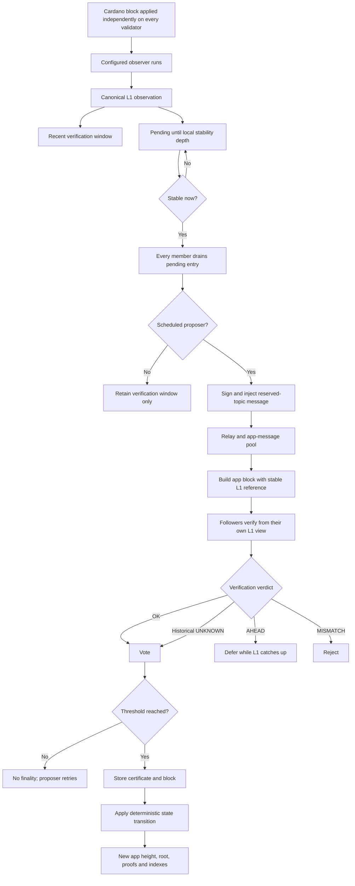
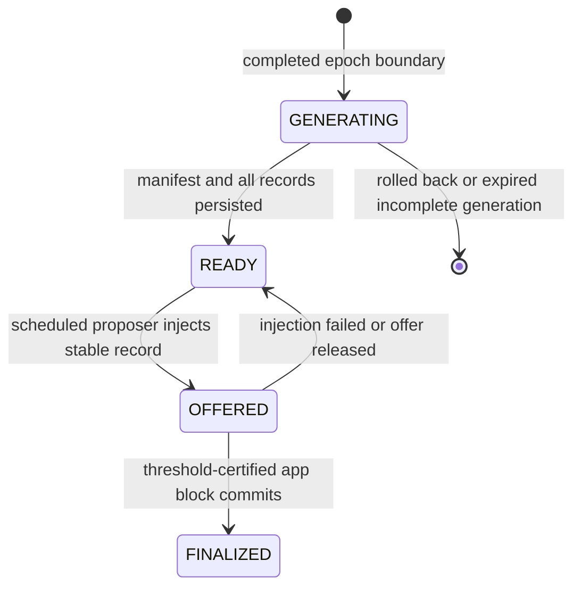
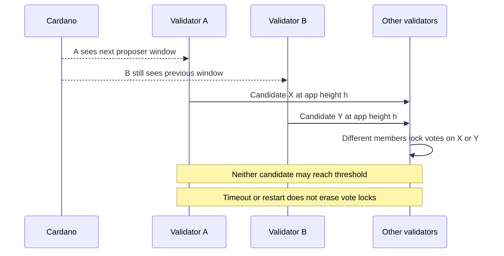
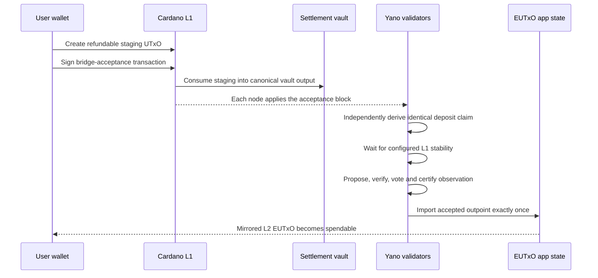
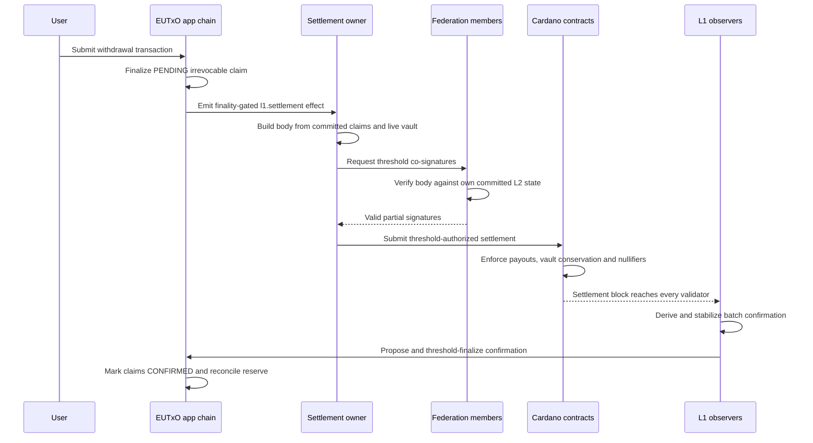

# ADR-042 — L1 observation and EUTxO settlement lifecycle

- **Status:** Accepted as the current lifecycle reference; reliability changes remain proposed in
  [ADR-041](041-trust-preserving-l1-observation-delivery-and-consensus-recovery.md)
- **Date:** 2026-08-28
- **Owners:** Yano app-chain host and Yano X observer, EUTxO, settlement, and deployment modules
- **Scope:** End-to-end Cardano L1 observation, app-chain consensus verification, EUTxO deposits,
  EUTxO withdrawals, L1 settlement confirmation, synchronization differences, and failure handling
- **Related:**
  [ADR-041](041-trust-preserving-l1-observation-delivery-and-consensus-recovery.md),
  [ADR-UTXO-001](app-layer/utxo/001-eutxo-state-machine-and-cardano-settlement.md),
  [ADR-UTXO-005](app-layer/utxo/005-scalable-eutxo-lifecycle-indexer-and-unified-console.md),
  [ADR-UTXO-009](app-layer/utxo/009-claim-settlement-process-and-vault-conditions.md),
  [ADR-008.4][yano-adr-008-4], and [ADR-027][yano-adr-027]

## 1. Purpose and decision

This ADR is the end-to-end reference for how a Cardano fact becomes deterministic Yano app-chain
state and, specifically, how the EUTxO payment-settlement chain moves value in both directions.

It records the following decisions and boundaries:

1. Cardano consensus and Yano app-chain consensus are separate. A fact confirmed on Cardano is not
   app-chain state until the app-chain validator threshold finalizes the exact observation.
2. Every app-chain validator runs the configured observer against its own Cardano stream. The
   proposer coordinates inclusion; it is not trusted to define the L1 fact.
3. An observation must be stability-deep and must not point beyond the app block's stable L1
   reference.
4. A voter independently compares a proposed observation with its own recomputation before voting.
5. EUTxO deposits credit L2 only after a stable, recognized vault-acceptance transaction finalizes
   through app-chain consensus.
6. EUTxO withdrawals first become irrevocable L2 claims, then execute on Cardano, and finally return
   through the same observation and app-chain-consensus path as an L1 confirmation.
7. A lagging validator may delay a proposal but cannot make the cluster accept a fact it has proven
   contradictory.
8. Ordinary L1 rollback before app-chain finality removes provisional observations. A rollback
   behind an already finalized value-bearing observation is a bridge halt and reconciliation event.
9. Operators may trigger inspection, retry, or guarded consensus recovery. They may not author a
   reserved `~l1/*` message, credited amount, destination, or settlement confirmation.

This ADR describes the implemented behavior. Where the current generic block-observation path can
lose an unfinalized fact during restart, pool pressure, expiry, or a prolonged consensus stall, it
labels that behavior as a known gap rather than describing the ADR-041 target as already shipped.

## 2. Terminology

| Term | Meaning |
|---|---|
| L1 tip | The newest Cardano point a particular Yano node has applied |
| Stable L1 point | A local Cardano point at least the configured stability depth behind the tip |
| L1 reference | The stable Cardano slot and block hash carried by an app-chain block |
| Observation | Canonical observer ID, Cardano anchor, and deterministic claim bytes |
| Block-scoped observer | Observer that runs over ordinary Cardano blocks and transactions |
| Epoch observer | Observer that prepares a completed epoch dataset through a durable local spool |
| Reserved topic | Runtime-only topic such as `~l1/bridge-deposits`; public submission is forbidden |
| Pending app message | Signed observation envelope waiting for inclusion in an app-chain block |
| Vote lock | Persistent promise by a validator not to sign another block hash at the same height |
| Finality certificate | Threshold signatures proving the app-chain block finalized |
| L2 finalized | Observation has been applied to authoritative app-chain state |
| L1 settled | Withdrawal transaction has executed on Cardano; L2 reconciliation may still be pending |

The L1 tip, stable L1 point, app-chain tip, accepted L2 state root, and latest Cardano anchor are
different values. Operations and UI must not collapse them into a single generic "synced" state.

## 3. Trust and authority

The trust path is:

```text
Cardano consensus
    -> independently synchronized Cardano view on each validator
    -> deterministic observer output on each validator
    -> threshold-certified Yano app-chain block
    -> deterministic app-state transition
```

The proposer has ordering and liveness power, but it does not have fact-authoring authority. For a
recent observation, each voter remains responsible for matching:

- observer identity;
- L1 slot and block hash;
- transaction or epoch anchor;
- canonical claim bytes; and
- configured chain, vault, asset, bridge epoch, and product identity where applicable.

An operator, deployment tool, effect executor, external indexer, or UI is not an L1 oracle. Data
provided by those components is untrusted until the configured validators independently derive or
verify it.

## 4. Generic block-scoped L1 observation lifecycle

### 4.1 Activation

An `L1ObserverProvider` is selected through the plugin catalog. Chain configuration supplies a
stable observer ID, observer type, and bounded settings under `observers.<id>.*`.

Every validator must activate the same observer implementation and consensus-critical settings. A
validator without the observer rejects a proposal containing its reserved observation topic.

For each applied Cardano block, every validator calls the observer with:

```text
(slot, block hash, parsed Cardano block)
```

The deterministic result is an ordered list of `L1Observation` values. A transaction observation
contains the observer ID, transaction anchor, L1 slot, block hash, and plugin-defined canonical
claim bytes. Its topic is derived as `~l1/<observer-id>`.

### 4.2 Local verification window and stability queue

Every validator stores recent self-computed observations in a bounded verification window keyed by
L1 slot and logical observation key. It also records the block hash observed at each slot.

Block-scoped observations initially enter an in-memory pending-injection map. They are not eligible
for app-chain sequencing until their slot is at or before the node's current stable L1 reference.
An ordinary L1 rollback removes window and pending entries above the rollback point.

When entries become stable, every validator drains them from its pending-injection map. Only the
validator that currently believes it is the scheduled proposer injects them into the app-message
pool. The proposer creates a signed, expiring message on the reserved topic and relays it to peers.

This current drain behavior is a known reliability gap: non-proposers also discard their pending
copy, and the generic block-observation path has no durable finalization acknowledgement. ADR-041
defines the required durable `STABLE_PENDING -> OFFERED -> FINALIZED` replacement.

### 4.3 Proposal, independent verification, and finality

The scheduled proposer selects pending messages and builds app-chain block `h + 1`. The block also
carries a stable L1 reference.

Before voting, each follower verifies:

1. chain, membership, proposer, signature, height, parent, and consensus-profile rules;
2. monotonicity and local validity of the block's L1 reference;
3. that every observation is decodable and appears only once in the block;
4. that each observation slot is at or before the block's stable L1 reference;
5. that the reserved topic and encoded observation agree; and
6. that the proposed observation matches the follower's own observation window or epoch spool.

Only after those checks does a validator persist its vote lock and sign. Once the configured
threshold is reached, the finality certificate and block are stored and the state machine applies
the observation deterministically.



### 4.4 Current verification verdicts

For the block-scoped observation window, the implemented verdict is selected as follows:

| Local relationship to proposed observation | Verdict | Live proposal behavior |
|---|---|---|
| Observation slot is newer than the node's newest applied slot | `AHEAD` | Defer; do not vote yet |
| Slot and block hash exist and claim bytes match | `OK` | Continue validation and vote |
| Same slot is in the window but block hash differs | `MISMATCH` | Reject fail-closed |
| Same slot is in the window but claim is missing or differs | `MISMATCH` | Reject fail-closed |
| Slot should be inside the retained window but no entry exists | `MISMATCH` | Reject fail-closed |
| Observation predates the retained window, or the window is empty | `UNKNOWN` | Current live path allows the threshold to vouch |

`UNKNOWN` is necessary for applying already certified historical app-chain blocks after pruning or
restart. It must not be turned into an operator-authored replay mechanism for a new value-bearing
fact. A future historical recovery must independently re-run the observer against pinned Cardano
evidence or verify an accepted proof, as required by ADR-041.

### 4.5 Bounded `AHEAD` deferral

When a live proposal is ahead of a follower's L1 view, the follower retries verification while its
Cardano stream advances. The current engine defers in short intervals for at least five seconds or
twice the configured app-block interval, whichever is larger. It then gives up that attempt and
expects the proposer to propose again.

The follower has not voted during `AHEAD`, so catching up does not require clearing a vote lock.

### 4.6 Catch-up after app-chain finality

A late app-chain member downloads already certified blocks. It still verifies monotonic L1
references and observations:

- `AHEAD` pauses catch-up until its Cardano view advances;
- `MISMATCH` rejects the certified block because local retained evidence contradicts it; and
- `UNKNOWN` accepts an older fact because the existing finality certificate proves that a threshold
  validated it when it was live.

This is different from introducing a new historical observation. Catch-up consumes a block that is
already final; recovery proposes a fact that has never been certified.

## 5. Epoch-observation lifecycle

Cardano History and other completed-epoch datasets use `L1EpochObserver`, not the generic
block-scoped pending map.

At each completed boundary, every validator:

1. opens L1 state pinned to that exact epoch boundary;
2. asks the observer for a deterministic manifest;
3. writes the expected ordered observation records;
4. persists them in an epoch spool as `GENERATING` and then `READY`;
5. waits for the boundary to reach the configured epoch stability depth;
6. lets only the scheduled proposer move eligible records to `OFFERED`; and
7. changes matching records to `FINALIZED` after the app-chain block commits.



The epoch spool is durable and is the implementation precedent for ADR-041. It does not remove the
need for matching observer configuration, independent follower verification, safe view change,
historical proof rules, or consensus recovery.

## 6. Nodes at different L1 points

### 6.1 L1 tip difference is expected

Geographically distributed nodes normally apply a new Cardano block at slightly different times.
They can therefore have different L1 tips while agreeing on an older stable point.

Example:

```text
proposer L1 tip:       slot 1,010
proposer stable point: slot 1,000
follower L1 tip:       slot   998
observation slot:      slot   999
```

The follower returns `AHEAD` for the observation and the proposed L1 reference. It does not vote
until it reaches and verifies that point.

If the follower tip were 1,020 and it retained slot 999, it would compare the exact block hash and
claim. Being ahead is not a problem; being contradictory is.

### 6.2 Different Cardano forks

Two nodes can temporarily hold different hashes for the same recent slot during an L1 fork. If the
proposed observation points to one hash while the follower's in-window hash differs, verification
returns `MISMATCH` and the follower rejects the app block.

The stability-depth gate is intended to let ordinary Cardano fork choice converge before an
irreversible app-chain transition. It reduces risk; it does not prove that a deeper rollback is
impossible.

### 6.3 Threshold effect in a five-member cluster

For a five-member, four-signature threshold:

| Members able to verify the exact proposal | Result |
|---:|---|
| 5 | Finality can proceed |
| 4 | Finality can proceed while one member is behind or unavailable |
| 3 | No certificate; liveness pauses |
| Fewer than 3 | No certificate; liveness pauses |

The threshold controls finality, not synchronization. One validator being behind is tolerable. Two
validators being unable to vote leaves at most three signatures and stops the chain safely.

### 6.4 Fixed versus rotating proposer consensus

With a fixed proposer, L1 tip differences can delay follower verification but do not change who is
allowed to propose.

With the current rotating proposer scheduler, members use their newest locally observed L1 slot to
calculate the proposer window. Near a window boundary, correct members at different L1 tips can
temporarily calculate different proposers. Competing proposals may then consume different members'
one-vote-per-height locks.



This is a consensus recovery limitation, not evidence that one of the Cardano facts is necessarily
false. ADR-041 selects quorum-certified views as the target. Until that exists, fixed proposer is
the deployment containment, and `admin/unlock-stale-round` is a guarded emergency procedure after
cross-node confirmation that no certificate exists.

Automatic timer-based vote-lock deletion is unsafe because a delayed or partitioned certificate
may exist.

## 7. Generic edge cases

| Condition | Current safe behavior | Operational consequence |
|---|---|---|
| Observer plugin throws on a block | Log bounded error metadata; follower checks still fail closed | Investigate plugin/config parity |
| Observation is not stability-deep | Do not include it | Wait for stable L1 progress |
| Follower is behind | `AHEAD`; defer without voting | Quorum may proceed if enough other members verify |
| Follower has contradictory recent evidence | `MISMATCH`; reject | Halt progress and investigate L1/config divergence |
| Follower pruned the old evidence | `UNKNOWN` | Accept certified catch-up; do not use for raw replay |
| Public caller submits `~l1/*` | Reject reserved topic | No external fact-authoring path |
| Proposal repeats the same observation | Reject | Proposer/runtime defect |
| App-message pool is full | Current generic injection drops and counts the event | Known loss gap; readiness must fail in target design |
| Process restarts before generic observation finalizes | In-memory pending data can be lost | Known ADR-041 gap |
| Observation message expires during a stall | It can disappear before finality | Underlying L1 fact remains true but L2 may not reflect it |
| Proposer omits a stable fact | Included facts verify, but completeness is not currently proved | Censorship/delivery gap |
| Ordinary L1 rollback before finality | Remove provisional observations above rollback | Re-observe the selected Cardano fork |
| Deep rollback behind finalized observation | Never mutate L2 silently | Halt bridge and reconcile explicitly |
| Competing app proposals split vote locks | No conflicting certificate, but height may stall | Safe view change or guarded recovery required |

## 8. EUTxO payment-settlement architecture

The settlement chain composes three different protocols:

1. deterministic EUTxO state and app-chain finality;
2. Cardano vault, root, and nullifier contracts; and
3. L1 observers that import deposits and settlement confirmations.

The Cardano anchor shown in the UI is a fourth, separate path. Anchoring publishes an L2 state
commitment to Cardano. It neither imports a deposit nor confirms a withdrawal.

```mermaid
flowchart LR
    A[Cardano deposit acceptance] --> B[Deposit L1 observation]
    B --> C[Yano app-chain finality]
    C --> D[Mirrored EUTxO and reserve credit]
    D --> E[L2 transfers]
    E --> F[Irrevocable L2 withdrawal claim]
    F --> G[Finality-gated settlement effect]
    G --> H[Federation co-signed Cardano settlement]
    H --> I[Withdrawal confirmation observation]
    I --> J[Yano app-chain finality]
    J --> K[Claim CONFIRMED and reserve reconciled]
```



## 9. Deposit lifecycle: Cardano L1 to EUTxO L2

### 9.1 Staging and acceptance

A user does not create an L2 deposit by sending ADA directly to the vault address. The bridge uses
a two-stage protocol:

1. The wallet creates a refundable staging UTxO containing the intended chain, L2 owner, nonce,
   refund deadline, depositor identity, and optional L2 key binding.
2. Before the deadline, a bridge-acceptance transaction consumes the staging UTxO and creates the
   recognized output at the canonical settlement vault.
3. If acceptance never occurs, the staging contract permits the user to recover the funds after the
   refund condition is satisfied.

The app chain never credits the staging output. Crediting refundable staging value would allow the
user to spend its L2 mirror and later refund the same ADA on L1.

### 9.2 What the deposit observer accepts

`eutxo-vault-deposit-v1` scans every Cardano transaction for exactly one vault output with the
expected script address and an inline `EutxoVaultDatum`.

It checks and canonically binds:

- app-chain ID;
- accepted transaction ID and output index;
- L1 slot and block hash;
- vault address and script hash;
- lovelace amount and configured maximum;
- absence of non-lovelace assets;
- intended L2 address and mirrored output;
- deposit nonce and staging outpoint;
- refund deadline and depositor key hash; and
- optional authorization-profile, key-epoch, and public-key binding.

The initial profile permits lovelace only. A transaction with more than one recognized deposit
vault output is rejected to keep observation identity and accounting unambiguous. Settlement-marker
outputs at the same vault are recognized as settlement data and are not treated as deposits.

### 9.3 Stability, app-chain finality, and credit

After the acceptance transaction reaches the configured stability depth:

1. the scheduled proposer injects `~l1/<deposit-observer-id>`;
2. followers match the exact acceptance claim against their own Cardano views;
3. the app-chain threshold finalizes the observation block; and
4. the EUTxO state machine imports the deposit atomically.

The state transition:

- keys the permanent deposit record by the accepted Cardano outpoint;
- derives the mirrored L2 outpoint deterministically;
- creates the L2 EUTxO for the intended owner;
- imports a valid optional L2 key binding;
- increases the committed lovelace reserve;
- records the deposit sequence and credited app height; and
- records the accepted outpoint as live vault custody for later settlement verification.

Reapplying the identical accepted outpoint and claim is a deterministic no-op. Attempting to bind
the same outpoint to different data fails closed.



### 9.4 Deposit edge cases

| Edge case | Result |
|---|---|
| ADA is sent directly to the vault without the accepted datum | No L2 credit; use the bridge acceptance flow |
| Only the refundable staging UTxO exists | No L2 credit; user may later refund according to the staging contract |
| Wrong vault/script, chain ID, datum, or key binding | Observation or state transition rejects |
| Native assets are included | Initial lovelace-only observer rejects |
| Amount is zero, negative, or above the configured limit | Observer rejects |
| Two recognized deposit outputs appear in one acceptance transaction | Observer rejects the ambiguous transaction |
| One validator has not reached the deposit slot | It returns `AHEAD`; four-of-five may still finalize |
| Validators see a different recent L1 block hash or claim | `MISMATCH`; no honest contradictory voter signs |
| Acceptance is on a rolled-back unstable fork | Pending observation is removed; no L2 credit |
| L1 acceptance is stable but app consensus is stalled | ADA remains in the vault; L2 credit waits |
| Generic observation expires or is lost before finality | Current gap: accepted ADA may remain without an L2 mirror |
| The user makes another deposit | Only the new outpoint is observed; it does not replay the older deposit |
| Same finalized observation is replayed | No-op if identical; conflicting rebind fails closed |
| Deep rollback removes a finalized accepted output | Halt deposits, withdrawals, and settlement; reconcile explicitly |

The state `L1 accepted but not L2 finalized` is economically important. It must be monitored and is
the motivating delivery gap in ADR-041. Unlocking a stale consensus round does not recreate an
expired observation, and manually posting claim bytes would introduce operator trust.

## 10. L2 transfers

Once deposited, the mirrored output is an ordinary EUTxO under the selected authorization profile.
L2 transfers consume existing EUTxOs and create new ones through deterministic app-chain
transactions. They do not touch Cardano and do not require an L1 observer.

An L2 transfer becomes authoritative when its app-chain block finalizes. The Cardano anchor may
later commit the resulting state root, but the anchor is not in the critical path for ordinary L2
spending unless a specific proof or settlement policy requires an accepted anchored root.

## 11. Withdrawal lifecycle: EUTxO L2 to Cardano L1

### 11.1 Creating the irrevocable L2 claim

A withdrawal is an L2 transaction that creates a specially formed lovelace-only output at the
configured withdrawal address with an inline `EutxoWithdrawalDatum`.

During the atomic EUTxO transition, the machine verifies:

- withdrawals are enabled, not paused, and the bridge is not halted;
- a committed reserve exists;
- chain ID and bridge epoch match;
- destination is a supported Cardano base or enterprise address;
- amount is within the configured per-claim maximum;
- payout after the governed executor bounty meets the minimum;
- claim identity has not already been used; and
- the pending-withdrawal limit is not exceeded.

The special output is converted into a committed withdrawal claim rather than remaining as an
ordinary spendable L2 UTxO. The state machine stores:

- claim ID and exact destination;
- payout, total locked amount, and frozen bounty;
- source outpoint, nonce, bridge epoch, sequence, and creation height;
- `PENDING` withdrawal status;
- withdrawal commitment for proof use; and
- reserve and pending-withdrawal accounting.

Once finalized, the user cannot cancel or redirect the claim by rewriting L2 state.

### 11.2 Deterministic batch trigger and effect

The settlement machine opens a batching window when an unsettled claim appears. It emits an
`l1.settlement` effect when either:

- the governed soft batch cap is reached; or
- the configured number of app-chain blocks has elapsed since the window opened.

The effect is gated on app-chain finality. It contains a deterministic claim-sequence range and an
idempotent settlement scope. The cursor prevents the same claim from being scheduled in two live
batches.

If the latest effect terminates as failed or expired, the machine rewinds that batch cursor and
reopens the window so the claims can be batched again. It does not recreate or change the claims.

### 11.3 Federation settlement on Cardano

Exactly one configured member owns execution for coordination. All members register the co-sign
service.

The owner:

1. reads the committed pending claims;
2. reads live vault, accepted-root, and nullifier-shard state from Cardano;
3. reconstructs and verifies the local nullifier mirror against the on-chain shard root;
4. builds the canonical settlement transaction;
5. broadcasts the unsigned body on the bridge co-sign channel;
6. collects the required member signatures;
7. submits the assembled transaction to Cardano; and
8. reconciles retries against committed state and the previously submitted body/transaction.

Every co-signer verifies the proposed body against its own committed L2 state. The Cardano vault
and shard validators additionally enforce positional payouts, exact destinations and amounts,
continuing vault conservation, member-threshold authorization, and nullifier insertion.

The owner is therefore a liveness coordinator, not a single custody key. A threshold and the L1
scripts authorize the value movement.

### 11.4 L1 confirmation returns through the observer path

After the settlement transaction lands on Cardano, every node's
`eutxo-batch-withdrawal-confirmation-v1` observer looks for the continuing vault output and canonical
batch marker.

The observer derives:

- ordered claim IDs from the marker;
- positional payout address and lovelace for each claim;
- bridge chain and epoch;
- settlement transaction ID;
- all spent transaction outpoints;
- continuing vault outpoint and remaining lovelace; and
- L1 slot and block hash.

Structurally invalid marker transactions are skipped deterministically. Anyone can pay the public
vault address, so output shape alone is not accepted as proof of settlement.

After stability and app-chain finality, the EUTxO machine requires the confirmation to consume at
least one outpoint already tracked as live vault custody. It removes consumed vault outpoints,
tracks the continuing vault outpoint, and verifies every claim ID, destination, amount, and bridge
epoch.

For each exact pending claim it then:

- changes status to `CONFIRMED` with the settlement transaction and L1 point;
- moves reserve accounting from pending to confirmed outflow; and
- decrements the pending-withdrawal count.

An unknown, mismatched, rebound, or custody-unproven confirmation halts the bridge rather than
silently releasing reserve accounting.



### 11.5 Permissionless fallback

The same vault design includes a proof-based fallback path after the configured delay. When the
federation stops progressing accepted roots or settlements, a cranker can prove committed claims
against the accepted root and prove nullifier non-membership. The L1 contracts enforce the payout
and update nullifiers.

This is a censorship/liveness fallback, not a shortcut around L2 claim finality. Claims newer than
the last accepted root may have to wait for a later accepted root or the relevant recovery policy.
Any resulting settlement still needs L1 observation and app-chain reconciliation for the live L2
status to become `CONFIRMED`.

### 11.6 Withdrawal edge cases

| Edge case | Result |
|---|---|
| Ordinary L2 transfer to a normal address | No withdrawal claim |
| Wrong withdrawal address or missing/invalid datum | Ordinary validation rejects or no claim is formed |
| Wrong chain ID or bridge epoch | Withdrawal rejects |
| Unsupported destination type | Withdrawal rejects before entering the oldest-first queue |
| Payout is below minimum or above maximum | Withdrawal rejects |
| Withdrawals are paused or bridge is halted | Withdrawal rejects |
| Pending-claim limit is reached | Withdrawal rejects with bounded backpressure |
| Settlement owner is offline | Claims remain pending; ordinary A2 liveness pauses |
| Too few co-signers agree on committed state/body | L1 transaction is not authorized or submitted |
| Effect fails or expires before L1 settlement | Latest batch cursor rewinds and claims re-batch |
| L1 transaction is submitted but unstable | Claims stay pending until stable confirmation finalizes |
| Fake marker pays the public vault address | Observer skips it or custody gate halts if it reaches state transition |
| Confirmation does not spend tracked vault custody | Bridge halts with reserve unchanged |
| Unknown or mismatched claim confirmation | Bridge halts |
| Identical settled confirmation is replayed | Existing exact confirmation remains idempotent |
| L1 settlement succeeds but confirmation delivery stalls | User has L1 payout; L2 may remain pending until safe replay/recovery |
| Deep rollback removes a finalized settlement | Bridge halt and explicit reconciliation |
| Federation censors after fallback delay | Permissionless proof exit may settle eligible accepted-root claims |

The asymmetry matters: a lost deposit observation leaves value on L1 without an L2 credit, while a
lost withdrawal-confirmation observation can leave the user paid on L1 but the L2 claim and reserve
still shown as pending. Neither case authorizes a database edit or operator-authored confirmation.

## 12. Two consensus systems and four completion points

For deposits:

```text
Cardano acceptance included
    -> Cardano acceptance stable
    -> Yano observation block finalized
    -> mirrored L2 UTxO available
```

For withdrawals:

```text
L2 claim finalized
    -> settlement effect executed
    -> Cardano settlement included and stable
    -> Yano confirmation block finalized
    -> L2 claim and reserve reconciled
```

The following statements are therefore not interchangeable:

- "The Cardano transaction is confirmed."
- "The Cardano transaction is stability-deep."
- "A Yano proposer has offered the observation."
- "A threshold-certified Yano block contains the observation."
- "The EUTxO state machine applied the deposit or confirmation."
- "The lifecycle indexer has caught up to authoritative app state."
- "The state root has been anchored back to Cardano."

The product UI should show these boundaries separately.

## 13. Consensus, synchronization, and settlement scenarios

| Scenario | Cardano result | App-chain result | Settlement result |
|---|---|---|---|
| One of five nodes is behind | Fact exists for four nodes | Four-of-five can finalize | Progress can continue |
| Two of five nodes are behind | Fact exists but only three can vote | No certificate | Deposit/confirmation waits |
| One node is ahead | It verifies the older stable fact | No problem if hashes/claims match | Progress can continue |
| Nodes have different recent L1 fork hashes | Cardano fork choice not converged | `MISMATCH`; reject | Wait and investigate |
| Fixed proposer is healthy but followers lag | One proposal, bounded deferrals | Retry until threshold catches up | Slower but no proposer split |
| Rotating nodes calculate different windows | Competing proposers possible | Split vote locks may stall height | Settlement/observation delivery waits |
| L1 transaction finalizes while app chain is stalled | Cardano state changes | No L2 transition yet | Economic intermediate state persists |
| App chain catches up after L1 pruning | Certified old fact may be `UNKNOWN` | Certificate vouches for catch-up | No new fact is introduced |
| Operator attempts raw historical replay | No independent derivation | Forbidden trust escalation | Must use proof-safe recovery |

## 14. Operational diagnosis

Operators should compare the same chain across every validator without printing secrets or private
infrastructure details.

### 14.1 L1 checks

- Is each node connected to an upstream and still processing Cardano blocks?
- Is each node at or near the remote tip?
- What are the local tip and stable L1 slot?
- Are nodes on the same recent block hash after accounting for propagation delay?
- Did a rollback occur near the observation slot?

### 14.2 App-chain checks

- Do all members report the same finalized height, root, genesis ID, commitment profile, consensus
  profile, and active membership threshold?
- Are all expected peers connected?
- Which node is the scheduled proposer?
- Are pool drops, L1-reference deferrals, or observer failures increasing?
- Is `staleLockedHeight` non-zero or are split votes increasing?
- Does any member already have the disputed height or certificate?

### 14.3 Observer and bridge checks

- Is the expected observer present with identical chain, vault, and bridge-epoch identity?
- Is the observation still provisional, stable pending, offered, or finalized?
- For epoch observers, how many records are `GENERATING`, `READY`, `OFFERED`, and `FINALIZED`?
- Does the deposit accepted outpoint appear in authoritative EUTxO state?
- Is the withdrawal claim `PENDING` or `CONFIRMED`?
- Did the settlement effect fail, expire, submit, or reconcile?
- Does the lifecycle indexer's finalized checkpoint equal authoritative app-chain height?
- Is the bridge halted, and if so, which bounded reason code caused it?

### 14.4 Forbidden recovery shortcuts

Never recover by:

- posting a public message on a reserved `~l1/*` topic;
- copying observation bytes from one node and treating them as trusted;
- editing RocksDB, SQLite projection data, reserve counters, or claim status;
- resetting retained app-chain state or regenerating genesis identity;
- making another deposit and assuming it will replay an earlier one;
- deleting vote locks on a timer; or
- treating an external indexer as authoritative for credited or settled value.

The guarded stale-round unlock may be used only after checking every member for an existing
certificate at the locked height. It restores the ability to vote; it does not restore a lost
observation. ADR-041 owns the trust-preserving delivery and recovery design.

## 15. Required safety invariants

### 15.1 Generic observations

1. Public callers cannot submit reserved L1-observation topics.
2. Every voting validator either derives the exact recent observation or applies explicit
   certificate-backed historical catch-up semantics.
3. Observation slot never exceeds the app block's stable L1 reference.
4. An in-window hash or claim mismatch rejects the proposal.
5. A validator without the configured observer rejects the proposal.
6. Duplicate observation identity in one block rejects the proposal.
7. App-state transition depends only on finalized block bytes and prior committed state.
8. Ordinary rollback removes only unfinalized L1 observations.
9. Deep rollback behind finalized value state halts rather than silently rewriting history.

### 15.2 Deposits

1. Refundable staging output is never credited.
2. Only a recognized stable vault-acceptance output creates a mirror.
3. Accepted L1 outpoint is the permanent exactly-once deposit key.
4. Mirrored L2 value and reserve credit change atomically.
5. Non-lovelace value cannot enter the initial settlement profile.
6. Conflicting replay fails closed.
7. Operator-provided values can never create reserve credit.

### 15.3 Withdrawals

1. A finalized claim cannot be cancelled or redirected.
2. Destination, payout, bounty, bridge epoch, and claim ID are committed before L1 execution.
3. Co-signers verify the complete body against their own committed L2 view.
4. L1 scripts enforce payouts, continuing custody, threshold authorization, and nullifiers.
5. Confirmation must spend tracked live vault custody.
6. Confirmation must exactly match a pending claim.
7. Unknown or mismatched confirmation halts the bridge.
8. Reserve reconciliation and status transition are atomic.
9. Effect retry never blindly creates an unrelated settlement body.

## 16. Observability requirements

The target deployment and product UI should expose bounded, non-secret values for:

- local and stable L1 points, sync lag, and rollback state;
- observer window or spool lifecycle counts;
- oldest stable unfinalized observation and backlog age;
- app-message pool pressure and observation-drop counts;
- proposer, threshold, round/view, vote-lock, and split-vote state;
- finalized app height/root and anchor height/root separately;
- deposit lifecycle from staging through L2 credit;
- withdrawal lifecycle from claim through L1 and L2 confirmation;
- settlement effect ownership, retry, expiry, and reconciliation state;
- authoritative-state versus indexer checkpoint lag; and
- bridge halt or quarantine reason.

Readiness should degrade or fail when value-bearing observations cannot be persisted, when the
validator threshold cannot verify them, or when bridge accounting is quarantined. A green Cardano
sync indicator alone is not bridge readiness.

## 17. Current limitations and target direction

The current system has strong recent-fact verification and deterministic EUTxO accounting, but the
generic block-scoped observation transport is not yet durable through finality. Specifically:

- stable generic entries are drained before finalization acknowledgement;
- non-proposers do not retain a durable delivery obligation;
- pool overflow, restart, expiry, or prolonged consensus stall can lose an unfinalized fact;
- included observations are verified, but completeness is not certified;
- live `UNKNOWN` is insufficient for trust-free manual historical replay; and
- fixed/rotating consensus lacks a quorum-certified higher-view recovery protocol.

ADR-041 selects the target combination:

```text
durable per-validator observation journal
    + deterministic observation identity and ordering
    + mandatory carry-forward
    + finalization acknowledgement
    + quorum-certified view change
    + independently verified historical recovery
```

That target must not be described as implemented until the upstream Yano consensus/storage changes,
matching Yano X observer integration, deployment migration, and multi-node qualification have
shipped against an exact compatible release identity.

## 18. Repository ownership

Yano core owns:

- generic observer SPI activation and reserved-topic enforcement;
- L1 verification windows and stable L1 references;
- proposal verification verdicts and app-chain finality;
- vote-lock, catch-up, view-change, and durable-journal infrastructure;
- generic observer status, health, metrics, and authenticated recovery triggers.

Yano X owns:

- deterministic EUTxO deposit and withdrawal-confirmation observers;
- canonical deposit, withdrawal, settlement, and proof contracts;
- EUTxO reserve, idempotency, custody, nullifier, and bridge-halt invariants;
- settlement effect executor, transaction builder, co-signing, and domain APIs;
- product UI lifecycle presentation;
- provider-neutral deployment configuration and operational playbooks; and
- packaged cross-node settlement qualification against an exact Yano release.

Yano X consumes the published Yano API and JVM distribution. This ADR does not authorize a source
checkout dependency, composite build, sibling build invocation, or product-specific activation in
the Yano host.

## 19. Consequences

### Positive

- Operators have one lifecycle model for deposits, withdrawals, Cardano sync, and app consensus.
- UI and monitoring can distinguish L1 inclusion, stability, L2 finality, and indexing.
- Different-tip behavior is explicit and fail-closed.
- The settlement owner is correctly described as a liveness coordinator rather than a fact oracle
  or single custody authority.
- Recovery procedures preserve the existing validator threshold and do not add an external oracle.

### Costs and cautions

- Two consensus systems and several asynchronous states make bridge operations more complex than a
  simple deposit API.
- A shallow showcase stability depth is not a production risk recommendation.
- One or two lagging validators have different liveness consequences depending on the threshold.
- Current generic delivery gaps require explicit monitoring until ADR-041 is implemented.
- Deep rollback and accounting divergence require a halt rather than automatic repair.

[yano-adr-008-4]: https://github.com/bloxbean/yano/blob/main/adr/app-layer/008.4-script-anchors-l1view.md
[yano-adr-027]:
  https://github.com/bloxbean/yano/blob/main/adr/app-layer/027-l1-rollback-safety-and-l1-state-observations.md
