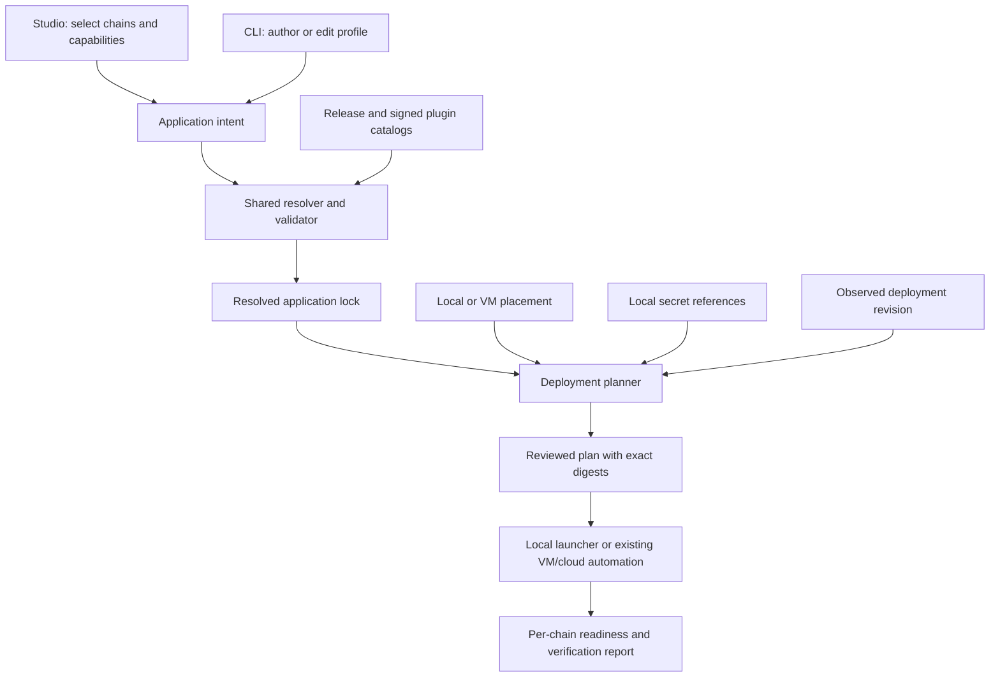

# Yano X deployment experience: independent review and design plan

Status: original review and roadmap. The implementation follow-up is
[ADR-047](../../adr/047-cohesive-application-deployment.md); current user workflows
are documented in the [deployment guides](deployment/README.md). Remaining roadmap
items below are not implied to be implemented. See the
[implementation validation record](DEPLOYMENT_EXPERIENCE_VALIDATION.md) for executed checks.

Reviewed on 2026-09-06 against Yano X commit
`366950619c0decdd95add0e0ee192b52241d6699`. Upstream host inspection was read-only,
against the sibling Yano checkout at `a69ccc2f2adae6c232917506075f991b9a2e59ee`.
The Yano X build defaults to Yano `0.1.0-pre13`; the sibling source is supporting
architectural evidence, not proof of behavior in that published artifact.

## 1. Recommendation

Yano X already has most of the building blocks for a good first-run experience.
The work should connect and qualify those blocks rather than introduce another
launcher, another configuration engine, or another runtime activation path.

Prioritize these outcomes:

1. Make the released showcase the obvious beginner entry point, with a short,
   tested download → start → submit → verify → restart journey.
2. Generalize the existing deployment tool so it consumes the same application
   intent as Studio and the CLI, instead of requiring the fixed showcase.
3. Support adding an independent chain through a planned, state-preserving
   deployment revision. Initially allow a coordinated process restart.
4. Extend the existing Studio into a multi-chain configuration wizard.
5. Add restart-free chain activation only after the state-preserving deployment
   contract has been proven and the host exposes the required lifecycle API.

The requested document-trail + ordered-log → add another chain scenario is
architecturally feasible. It is **not currently a supported end-to-end tooling
workflow**, and **live chain registration requires upstream Yano changes**.
There is no reason to reset unrelated chains merely to create a new independent
chain. Replacing the state machine or genesis of an existing chain is a different,
consensus-sensitive operation and must not be disguised as chain addition.

## 2. Scope and evidence standard

This review covers distribution assembly, showcase scripts and identity guards,
project generation, Studio, VM deployment, relevant tests and documentation,
and the upstream multi-chain manager/storage assembly. It is not a comprehensive
security audit, benchmark, live-cloud certification, or consensus correctness audit.

Checks executed during the review:

| Check | Result | What it establishes |
|---|---|---|
| `node --test tooling/studio/src/test/studio.test.mjs` | 8 passed | Existing intent, catalog trust, safe links, and static-shell contracts |
| `bash examples/showcase/src/test/scripts/showcase-contract.sh` | Passed | Facade, identity, scaling, redaction, join, and governance contracts using isolated stubs |
| Source and test inspection | Completed | Implementation boundaries and gaps described below |

These checks do not start real nodes. No retained cluster, cloud host, secret,
or upstream source was changed. Full distribution, Java, live restart, and
public-network transaction tests were not run for this documentation review.

The public GitHub release page could not be retrieved during the review.
Therefore this document does not claim a particular Yano X release asset is
currently downloadable. Archive names below describe repository packaging;
public publication and clean-machine installation remain release acceptance gates.

## 3. Goal-by-goal assessment

| Goal | Current implementation | Missing outcome | Priority |
|---|---|---|---|
| Beginner demo in a few commands | `showcase.sh doctor` and `quickstart`; thirteen light-profile chains; local devnet; UI and scenario helpers | Obvious release download, platform prerequisites, concise onboarding, clean-machine evidence | P0 |
| Easy remote VM deployment | Java deployer generates OpenTofu/Ansible; existing VMs and three cloud adapters; systemd, ingress, monitoring, locks, health checks | General application profiles, simpler operator input, qualified upgrade/recovery and provider matrix | P1 |
| Start with N chains; add more without reset | Host supports multiple independently stored chains at startup | Multi-chain authoring plus safe additive deployment; live host registration for restart-free operation | P1/P2 |
| Spring Initializr-like configuration | Static Studio already selects recipes/capabilities and downloads a blueprint | Multi-chain editing, placement, deployer handoff, explicit readiness and release identity | P1 |
| Step-by-step deploy/insert/verify docs | Extensive tutorials and showcase guides | One release-oriented route per audience; eliminate stale source instructions; executable guide acceptance | P0 |

Here N means a configurable number of chains within a measured resource envelope,
not unlimited chains or unlimited validators. Chain count and node/member count
must be separate concepts in both UI and CLI.

## 4. Findings tied to the implementation

### F1 — The demo runtime is ahead of its front door

[Showcase README](../../examples/showcase/README.md) and
[the launcher](../../examples/showcase/src/main/showcase/showcase.sh) already
provide a substantial demo. Light quickstart starts the cluster, bootstraps the
workflow devnet SCRIPT anchor, runs composite and authenticated-map scenarios,
verifies convergence, and prints the UI URL. It does not demonstrate every
installed capability automatically.

Java 25, Python 3, curl, and jq are prerequisites. The light profile does not
require Kafka, S3, IPFS, or Docker. Evidence and EUTxO/ZK are separate journeys;
they have additional services or bootstrap work. “All key capabilities” should
mean a curated set of demonstrated outcomes, with explicit optional extensions.

The [root README](../../README.md) leads with build instructions, while
[the showcase master guide](../../examples/showcase/docs/MASTER_DEMO.md) offers
the experience beginners actually want. Promote the latter through a short
release quickstart. Keep detailed presenter and developer material available
after the first successful outcome.

### F2 — Launcher safety intentionally blocks arbitrary chain-list edits

[showcase_identity.py](../../examples/showcase/src/main/showcase/tools/showcase_identity.py)
validates known showcase chain sets and pins chain IDs, configuration, plugin,
and genesis-related inputs. The supported marker evolution documented today is
additive anchor enablement, not arbitrary chain addition.

[cluster.sh](../../scripts/appchain-cluster/cluster.sh) also compares configured
chain IDs against retained standalone app-chain identity. These are safeguards,
not bugs to remove. A new deployment revision mechanism must authorize an exact
additive change while retaining the old checks for unplanned drift.

### F3 — Multi-chain hosting exists; multi-chain project authoring does not

[AppChainProjectResolver](../../tooling/devtools/src/main/java/com/bloxbean/cardano/yano/appchain/devtools/AppChainProjectResolver.java)
explicitly rejects `spec.chains().size() != 1` and renders chain index zero.
[AppChainProjectLifecycle](../../tooling/devtools/src/main/java/com/bloxbean/cardano/yano/appchain/devtools/AppChainProjectLifecycle.java)
also limits drift inspection to one chain. Its `migrate` method validates the
current schema and returns `NO_MIGRATION_REQUIRED`; it is not a runtime upgrade
or state migration implementation.

An array in the blueprint schema is consequently not evidence that arbitrary
multi-chain projects can already be generated and deployed.

### F4 — Host startup is multi-chain, but the registry is fixed

The following paths are in the **upstream Yano repository**, not Yano X:

| Host source | Evidence |
|---|---|
| `runtime/.../internal/RuntimeNode.java`, `buildAppChainManager()` | Iterates configured chains and assembles subsystems during runtime construction |
| `runtime/.../appchain/AppChainManager.java`, constructor | Builds an unmodifiable map and a fixed lifecycle list |
| `runtime/.../appchain/AppChainManager.java`, `serverAgentFactories()` and `unionTransportConfig()` | Shared inbound protocol configuration depends on the configured chain set |
| `runtime/.../appchain/AppChainSubsystem.java`, constructor | Appends `chainId` to the app-chain ledger storage root |
| `runtime/.../appchain/AppChainSubsystem.java`, `startOwnedResources()` | Opens the retained store, verifies integrity, and honors persisted governance |

All paths above begin with
`runtime/src/main/java/com/bloxbean/cardano/yano/`.

Per-chain storage makes state-preserving addition plausible. It does not prove
that editing YAML and restarting the exact released host is a supported upgrade.
The launcher markers, plugin catalog, config binding, transport, and retained
governance still need an explicit compatibility test. A mutable map alone would
not make live activation correct: sessions, APIs, health, event subscriptions,
resource ownership, and failure cleanup must all see the same lifecycle state.

### F5 — VM automation is substantial but specializes in one showcase

[Deployment schema](../../deployment/schema/yano-cluster-deployment.schema.json)
fixes the application profile to
`distributed-showcase-preprod-anchored-settlement-v1`, requires anchoring and
settlement, and selects all chains for anchoring.
[DeploymentRenderer](../../tooling/deployment/src/main/java/com/bloxbean/cardano/yano/appchain/deployment/DeploymentRenderer.java)
renders that catalog, special-cases named chains, and uses fixed positions for
some generated settings.
[ShowcaseProfileCompiler](../../tooling/deployment/src/main/java/com/bloxbean/cardano/yano/appchain/deployment/ShowcaseProfileCompiler.java)
invokes the release-matched showcase compiler for specific map chains.

This is useful showcase automation; it is not yet a general deployer for the
user's two-chain profile or Studio output. Requiring settlement records and
anchoring inputs for an ordinary log/document application creates unnecessary
setup work.

[DeploymentLifecycle](../../tooling/deployment/src/main/java/com/bloxbean/cardano/yano/appchain/deployment/DeploymentLifecycle.java)
already provides artifact/manifest-bound rendering, plan/apply, destructive-plan
rejection, and a journal. Extend these mechanisms.

The [deployment runbook](../../deployment/README.md) explicitly documents a
temporary full-cluster stop/start to recover peer connectivity in the pinned
host. Current apply must not be marketed as zero-downtime rolling upgrade.
[ADR-039](../../adr/039-geographically-distributed-deployment-automation.md)
also distinguishes implemented automation from remaining live-provider and
geographic qualification. Render/fixture tests alone do not qualify remote operations.

### F6 — Studio already implements the requested starter-page pattern

[Studio](../../tooling/studio/README.md),
[studio-core.mjs](../../tooling/studio/src/main/web/studio-core.mjs), and
[app.mjs](../../tooling/studio/src/main/web/app.mjs) implement release-pinned
recipes, capability dependency/conflict checks, non-secret answers, blueprint
preview/download, safe links, and signed custom catalog import.

The UI emits one chain, with empty member keys and node hosts. This is valid
authoring intent, not a ready-to-run operator deployment. It exports
`AppChainProject`, while the VM deployer consumes another contract.

Use [Spring Initializr](https://start.spring.io/) as the interaction reference
named in the request; there is no need to clone its implementation. Extend
Studio and keep the CLI authoritative. The Yano-hosted runtime console is a
different UI and should retain its current ownership.

### F7 — Release identity needs clearer vocabulary

[Studio build](../../tooling/studio/build.gradle) and
[devtools build](../../tooling/devtools/build.gradle) expand the DX field named
`yanoVersion` from the Yano X project version. Lifecycle doctor compares it to
the tooling version. Meanwhile the build property `yanoVersion` selects the
upstream host, which can have a different version.

This is a naming/contract ambiguity, not evidence of a broken archive. A new
deployment contract should separately pin Yano X release, Yano host release,
artifact SHA-256, catalog/schema versions, and plugin bundle digests. Add a
test where host and extension versions differ, so future UI/deployer integration
does not accidentally equate them.

### F8 — Some beginner instructions still describe the old repository

[Tutorial 1](tutorials/01-first-app-chain.md) directs source users to
`:app:quarkusBuild` and `cd app`, and discusses a native executable. Those are
not Yano X source/build instructions. Its Studio link also uses a relative
source path that needs qualification in both the published site and extracted
distribution. Successful deep-link parsing tests do not prove that link resolves.

The [release acceptance document](RELEASE_ACCEPTANCE.md) usefully distinguishes
packaged support, tested business outcomes, preview features, and alpha schemas.
Carry those distinctions into onboarding rather than presenting every checkbox
as production-qualified.

## 5. Target configuration architecture

Use one application compiler, with separate placement and local-secret inputs.
The names below describe proposed contracts, not new files already implemented.



The application intent should contain stable chain IDs, selected state machine
or composition, chain capabilities, public genesis configuration, consensus
policy, and plugin references. Resolve capabilities independently per chain;
merge process-wide plugin requirements separately and reject provider collisions.
For example, alternative bundles that export the same state-machine contribution
cannot coexist merely because the UI places them on different chains.

Placement specifies nodes, chain participation, network addresses, storage,
resource limits, effect/anchor owners, and exposure. Begin with every chain on
every validator; subset placement can follow after its verification model is
qualified. Credentials remain local secret references, outside downloadable
profiles and public share links.

Keep existing `appchain.yaml` authoring where practical. Evolve its schema and
the VM deployment schema deliberately, rather than require users to maintain
duplicate application definitions. The deployment manifest should reference the
resolved application lock and its digest. The showcase becomes a curated recipe
compiled through this route; its demonstration-only providers remain explicit.

Use `config/artifacts-v1.json` as the artifact inventory. Generate UI/CLI
metadata from existing capability and recipe registries and signed plugin
descriptors. Do not introduce a second artifact inventory in the wizard.

## 6. Beginner demo design

### First supported route

Publish a versioned showcase download with checksums and platform prerequisites.
Start with macOS/Linux JVM use. Document other platforms only after qualification.
A bundled Java runtime or container image can reduce prerequisites later, but
requires an explicit packaging/update decision and platform testing; it should
not delay improving the existing ZIP route.

The first screen should say what users will see: replicated order events,
document trails, governed approvals, an authenticated-map proof, an external
effect receipt, and a devnet anchor. Keep Kafka/S3/IPFS, ZK, public-network
settlement, and costly history scans as named follow-on demos.

The commands below are **existing command shapes**, for a newly extracted,
version-matched showcase with prerequisites installed. They were inspected,
not executed against a live release during this review:

```bash
# From the extracted showcase directory containing showcase.sh:
./showcase.sh doctor --profile light
./showcase.sh quickstart --profile light --nodes 3 --instance first-demo
./demos/submit-orders.sh first-demo '{"order":"A-100","event":"created"}'
./demos/submit-documents.sh first-demo document-A-100
./showcase.sh verify all --instance first-demo
./showcase.sh ui --instance first-demo
```

Expected outcomes: three ready nodes; converged per-chain height/root; the new
order's finalized-message proof; a document-trail scenario; and a printed console
URL. A chain at height zero has not demonstrated application finality. The
quickstart's workflow anchor does not mean all thirteen chains are L1 anchored.

Then demonstrate persistence:

```bash
./showcase.sh stop --instance first-demo
./showcase.sh restart --instance first-demo
./showcase.sh verify all --instance first-demo
```

Capture the pre-stop application IDs and finalized heights, then retrieve the
same records after restart. If background observers progress, compare roots at
the same finalized height, not two changing tips. Do not use reset to recover
from a failed first run.

### Improvements to the existing facade

Add a compact progress/report format: prerequisites → process readiness → chain
readiness → submitted → finalized → proof checked → anchor status. Print one
actionable failure and the relevant log path. Support bounded retries and resume
after interruption. Show whether an action merely inspects data or submits it.

Target acceptance: after download and prerequisite installation, at most three
commands to a verified first useful outcome; a beginner can complete the guided
journey without source checkout, Gradle, Maven Local, private credentials, or
public-network funds. Measure timing and minimum RAM/disk on published hardware
before advertising setup-time guarantees.

## 7. Adding chains without resetting existing state

### 7.1 Define the supported operations

| Operation | Required treatment |
|---|---|
| New independent chain with a stock machine | New chain ID, new pinned genesis, new per-chain storage; preserve existing chains |
| New chain using a custom JVM plugin | Same, plus exact compatible bundle, dependency/collision checks, and trusted catalog |
| New chain using another genesis profile | Pin that profile and its bytes for the new chain only |
| Add a validator to an existing chain | Existing membership governance; distinct from adding a chain |
| Change machine, commitment encoding, or genesis of an existing chain | Explicit consensus/state migration design or a new chain identity |
| Upgrade a shared plugin used by existing chains | Separate compatibility review; not automatically a harmless chain addition |

Terminology: `ordered-log` and `doc-trail` are state-machine IDs. `orders-chain`
and `documents-chain` are showcase chain IDs. A custom chain can use a different
chain ID while selecting either machine. Multiple chains are independent;
adding one does not give them atomic cross-chain transactions.

### 7.2 First milestone: planned addition with a controlled restart

The proposed CLI experience is:

```text
# PROPOSED; these commands do not exist today.
yano.sh appchain chain add ./cluster --chain-id inventory-chain --recipe owned-registry
yano.sh appchain deployment plan ./cluster
yano.sh appchain deployment apply ./cluster --plan <plan-file>
yano.sh appchain deployment verify ./cluster
```

These are extensions to the public `yano.sh appchain` facade. Its deployment
adapter should reuse `yano-x-deploy` internally, not implement parallel VM logic.

The plan should explain: two existing chains unchanged, one new chain, exact
plugin additions, new resource needs, affected nodes, expected interruption,
and any separate bootstrap still pending. It must not contain a reset.

Required protocol:

1. Read and validate the previous deployment lock and live identities. Acquire
   an exclusive deployment operation lease; reject competing or stale plans.
2. Classify changes by stable chain ID. Reject deletion, rename, member-policy
   drift, existing genesis/commitment changes, or unreviewed bundle replacement
   in an additive plan. Compare resolved meaning, not only YAML bytes.
3. Allocate and persist the new genesis identity once in the reviewed plan.
   Re-rendering or retrying must reuse it. Preserve all existing genesis bytes,
   effective governance epochs, stores, and pinned configuration.
4. Resolve the combined plugin catalog and check host API compatibility,
   bundle dependencies, contribution collisions, and per-chain capability
   manifests. An added bundle may change a node-wide catalog fingerprint;
   explicitly authorize that change without changing old chain semantics.
5. Stage immutable artifacts and configuration on every target. Verify exact
   digests and resource capacity before activating any node. Maintain stable
   chain-ID mapping even if serialized configuration uses numeric indexes.
6. Record a quiescent checkpoint or common finalized reference for existing
   chains. Establish recoverable backups using the supported snapshot/backup
   procedure, not copying open RocksDB files. Keep L1 and app-chain stores
   separate; indexes remain rebuildable derivatives.
7. For the initial release, drain and stop the selected cluster in a documented
   maintenance window. Atomically switch each node's release/config pointer,
   install the authorized identity revision, then restart and reconcile peers.
8. Verify every old chain at the saved finalized reference, including retained
   records/proofs and active governance. Check the new chain's identity,
   members, capability digest, transport, and initial state across all members.
9. Enable the new chain's ingress only after readiness succeeds. Run a separately
   authorized first-write check, then verify finality and proof retrieval.
   Enable effects/anchoring only according to the selected bootstrap policy.
10. Persist completion and release the lease. Re-running the same operation
    should report completion or resume its recorded phase, never create another
    genesis or reinitialize existing storage.

Atomic pointer changes are per host, not a distributed transaction. The durable
operation journal must record acknowledgements by node and distinguish staged,
switched, started, verified, and accepting-traffic states. A controller crash
must be recoverable from those states.

Before the new chain has accepted finalized work, a failed deployment may restore
the old configuration if its artifact/storage compatibility is confirmed. Retain
any new chain storage for diagnosis. After finalization, external effects, or L1
transactions, do not silently remove the chain or roll back its history. Pause it
and resume/repair forward. Automatic runtime binary downgrade is unsafe unless
the storage and protocol compatibility contract explicitly permits it.

This first milestone may be achievable largely in Yano X, but must pass against
the exact host artifact. Add generic host changes only where qualification shows
they are required. Do not bypass identity checks to force the test to pass.

### 7.3 Later milestone: add a chain to a running process

Yano must own a generic chain lifecycle API with explicit prepare, activate,
inspect, pause, and abort semantics. Yano X owns its planner and operator UX.
Runtime activation continues through `PluginProviderRegistry` and schema-v1
plugin manifests.

Suggested lifecycle:

```text
ABSENT → PREPARED → STARTING → READY → ACTIVE
                      ↓         ↓
                    FAILED    PAUSED
```

The host needs validated immutable registry snapshots, atomic gateway visibility,
bounded lifecycle cleanup, resource quotas, metrics registration, and correct
late wiring to the L1 event feed. Transport negotiation and existing inbound
sessions must accept the new chain deliberately; a registry update alone cannot
update cached protocol limits or chain filters.

Use an authenticated, authorized management API with operation IDs and plan
digests. Require all intended members to acknowledge the same genesis and
capability contract before opening new-chain submissions in the first version.
This deployment coordination is not a replacement for the new chain's finality
protocol. It need not mutate an unrelated chain just to register the new one.

Initially allow live activation only for compatible providers already installed
and available in the host's catalog. New plugin installation can require a process
restart. Dynamic classloader/plugin replacement has a wider failure surface and
should be a separate host design, especially when old chains share a provider.

Late-added L1 observers need a deterministic starting point: future observations
only, an exact checkpoint, or bounded historical replay. Pin that choice in the
new genesis/profile; reject unavailable/pruned history. Do not derive consensus
start state independently from each node's current wall clock or L1 tip.

## 8. Remote operator deployment design

Generalize ADR-039 rather than replace it. The first general profile should be
existing Linux VMs plus a resolved application lock. Cloud provisioning can use
the same runtime renderer after addresses are resolved.

Provide a short wizard for public node addresses, SSH account, network, chain
profile, secret references, API exposure, and optional monitoring. Separate
anchoring, settlement, and external connectors from baseline deployment. Generate
the full manifest with explicit defaults and a redacted review summary.

Improve the existing plan to show both infrastructure changes and application
changes. For an existing-VM-only deployment, an empty OpenTofu plan does not
explain service restarts, configuration changes, plugin changes, or ingress updates.

The operator route should be:

1. Download a pinned JVM release and application profile; verify artifact identity.
2. Establish SSH/sudo access using the packaged two-phase VM bootstrap if needed.
3. Resolve secrets locally and validate public keys against the intended members.
4. Run doctor and plan; review application and infrastructure changes together.
5. Apply the exact plan, then wait for per-chain readiness and peer convergence.
6. Submit and verify one authorized application command through the configured
   endpoint, using the documented credential mechanism.
7. Perform optional anchor/settlement bootstrap as separately authorized steps.
8. Exercise restart, interruption recovery, and backup restoration before handing
   the deployment to users.

Qualification must include a repeated no-change apply, interrupted apply, host
reboot, disk exhaustion, invalid credentials, closed ingress before readiness,
IPv4/IPv6 exposure, expired TLS, and secret-redaction failures. Record supported
OS/architecture/provider versions and resource floors as measured evidence.

Do not promise rolling availability while the pinned host requires full mesh
recovery by restarting the cluster. Even after reconnect is fixed, calculate
quorum safety and proposer availability per chain; a fixed proposer restart can
pause finality despite enough remaining voters.

## 9. Studio design

Extend the existing static Studio with this flow:

1. **Choose an outcome:** demo, new deployment, or extend an existing deployment.
2. **Add chains:** one card per stable chain ID; choose stock recipe, composition,
   custom plugin, or supported genesis profile.
3. **Choose capabilities:** show required dependencies, conflicts, maturity,
   bootstrap needs, and external services. Distinguish chain-local capabilities
   from process-wide bundle selection.
4. **Choose placement:** local cluster or VM deployment; node count is separate
   from chain count. Hide advanced consensus settings behind explanations.
5. **Review and download:** application intent, schema references, exact release
   pins, placement template, secret-reference examples, and generated next steps.

For “extend existing,” import a redacted deployment lock, preserve old chains as
read-only by default, and show the addition diff. The browser cannot establish
that imported live state is current; the CLI revalidates it before apply.

Label a download “configuration ready” only when authoring validation passes.
Show separate statuses for identities, artifacts, runtime, application bootstrap,
executors, external services, and verified outcome. Reuse the staged readiness
model already present in project doctor.

Keep the browser free of cloud credentials, private signing keys, and automatic
deployment. Trusted custom catalog metadata is data, not arbitrary executable
browser logic. Render and semantically validate using the matching CLI; verify
UI/CLI parity with fixtures for valid and invalid multi-chain selections.

For Yano X, offer JVM deployment. Existing core-host/native vocabulary should not
suggest that Yano X plugins can run in a native image. Keep the hosted operational
console in Yano; this work extends the already separate authoring Studio.

## 10. Documentation delivery plan

Make `docs/` authoritative and import through the existing site pipeline.
Consolidate reusable onboarding content from showcase-local documents; avoid
maintaining two copies of the same guide or editing generated site content.

| Guide to create or revise | Required observable result |
|---|---|
| Release download and prerequisites | Correct archive, checksum, supported platform, passing doctor |
| First local Yano X demo | Three nodes; one submitted order; one verified proof |
| Document trail walkthrough | Encoded command, finalized document record, read/proof result |
| Configure with Studio | Downloaded intent passes the matching CLI; remaining bootstrap explained |
| Deploy to existing VMs | Ready services, peer mesh, matching chain identities, authenticated API |
| Deploy with a cloud provider | Same application result plus reviewed infrastructure plan |
| Add a chain without reset | Original records/proofs survive; new chain finalizes; restart succeeds |
| Upgrade and recover | Interrupted operation resumes; backup restoration preserves identity |
| Verify independently | Separate finality, state proof, and independently checked L1 anchor |

Each guide must specify exact release, working directory, prerequisites, secret
references, commands, expected output fields, bounded waits, failure diagnostics,
and state-preserving stop/restart. Prefer high-level typed helpers first; show
the corresponding HTTP request and SDK example next.

Use [message submission](../../examples/showcase/docs/MESSAGE_SUBMISSION.md)
and [the curl master guide](../../examples/showcase/docs/MASTER_DEMO_CURL.md)
as source material. Explain that HTTP 202 is admission, not finality; a stateful
command can be included yet fail its business condition. Verify the resulting
record or claim as well as message inclusion. Use bounded polling with a clear
timeout and diagnostics rather than an endless wait loop.

Show three distinct verification levels: member-finalized block/certificate;
proof against a trusted root and pinned chain identity; and independent Cardano
anchor verification. A proof checked against a root returned by the same node
does not independently establish L1 anchoring. For public networks, guide scripts
must not submit bootstrap or smoke transactions without explicit authorization.

Run guide commands against the actual extracted release in CI where possible.
Link checks must cover both the published site and archive layout. Release build
checks should ensure the advertised archive and the tested archive are identical.

## 11. Sequenced implementation backlog

Estimates below are relative scope, not delivery-date commitments. P0/P1/P2
describe priority; host qualification can change ordering within a milestone.

| Milestone | Scope and owner | Depends on | Exit gate |
|---|---|---|---|
| M0: release-first onboarding | Small/medium; Yano X docs, showcase, release pipeline | Existing archive | Clean-machine download/start/submit/proof/restart passes; links and prerequisites correct |
| M1: multi-chain compiler | Medium/large; Yano X devtools/catalogs | Contract design | N-chain render, deterministic locks, per-chain drift, collision and identity tests |
| M2: general VM profiles | Medium/large; Yano X deployment | M1 | Studio/CLI profile deploys to existing VMs without mandatory showcase/settlement |
| M3: additive deployment revision | Large; Yano X lifecycle plus host qualification | M1; M2 for remote acceptance | Two retained chains → three, no reset, failure recovery, proof and root parity |
| M4: multi-chain Studio | Medium; Yano X Studio/docs | M1; M2/M3 contracts | UI export → CLI plan → local/VM deployment, including existing-lock import |
| M5: restart-free activation | Large; upstream Yano lifecycle/API, then Yano X adapter | M3 and host ADR | Add supported chain while old chains continue; crash/session/observer/plugin isolation tests |

M0 can proceed immediately. Design M1 and M3 together so multi-chain generation
does not accidentally regenerate existing genesis identities. M2 and Studio
implementation can proceed once that contract is stable. Avoid blocking the
state-preserving restart milestone on dynamic plugin loading.

Suggested implementation ownership:

- Devtools: replace single-chain assumptions in resolver, lock, renderer,
  lifecycle/drift, GitOps export, schemas, and tests.
- Deployment: accept application locks; replace fixed showcase chain indexes;
  implement application diffs and durable deployment revisions.
- Showcase: use compiled recipes and explicit marker migration, preserving its
  presentation helpers and demo-only plugin boundary.
- Studio: multi-chain authoring, import, readiness, and compiler parity.
- Yano host: generic live lifecycle and reconnect/observer changes only where
  needed; publish an exact compatible host release for Yano X to consume.

## 12. Acceptance matrix for chain addition

Use disposable clusters for this qualification, never reset a retained demo.

| Scenario | Required evidence |
|---|---|
| Two chains → three, stock machine | Old genesis/profile/capability identities unchanged; old records and proofs retrievable; new chain finalizes |
| Add authenticated-map with new genesis profile | Identical compiled genesis bytes and identity on every member; no old identity regeneration |
| Add custom provider | Exact bundle digests/API bounds; catalog activation; missing/mismatched/colliding bundles fail before activation |
| Reorder YAML or add chain before an old list entry | Stable chain-ID binding; old storage and consensus settings unchanged |
| Existing governed membership | Persisted active/scheduled epochs survive; static bootstrap values do not overwrite them |
| Repeat apply or crash after staging/switch/start | Same operation and genesis resume; no duplicate initialization or erased stores |
| One unavailable member or failed new-chain start | Explicit incomplete state; no premature ingress; recovery without resetting old chains |
| New observer on an advanced L1 node | Agreed checkpoint/backfill policy; pruned-history failure handled explicitly |
| Restart and catch-up after addition | Same chain set/identities; certificates, proofs, and common-height root parity |
| Rollback/replay around L1 changes | Appropriate chain apply/rollback/replay behavior and root parity; indexes never ahead of authoritative state |
| Effects or anchors active | Correct ownership and finality gating; no duplicate incorporated result; anchor state preserved |
| Live activation milestone | Old-chain workload continues within measured latency/error budget; no leaked threads/listeners/sessions |

Run focused unit tests while implementing, artifact inventory checks for manifest
or bundle changes, JVM-only checks for topology changes, relevant integration and
crypto suites, distribution checks, and showcase script/distribution contracts.
Then run the actual multi-node upgrade and restart tests against the exact
packaged Yano/Yano X pair. Passing only renderer tests is insufficient.

## 13. Decisions to record before implementation

Recommended defaults are provided so design can proceed without an open-ended
requirements phase:

| Decision | Recommended starting point |
|---|---|
| Does “same running instance” allow a restart? | Deliver preservation across controlled restart first; explicitly track uninterrupted activation as M5 |
| Initial chain placement | All selected chains on all validators; qualify subset placement later |
| Public front door | Released showcase for demos; Studio → application lock → existing deployer for operator profiles |
| Initial chain addition policy | Additive only; no implicit chain deletion, rename, or existing genesis replacement |
| New plugin installation | Exact compatible bundle with restart first; live activation initially limited to available providers |
| Anchor/settlement default | Optional and explicit for general operator profiles; curated devnet bootstrap only for demos |
| Supported chain count | Publish a measured envelope, resource guidance, and limits rather than promise arbitrary scale |
| Version contract | Separate host, Yano X, schema/catalog, artifact, and per-chain identity fields |

Create an ADR for shared multi-chain application/deployment revisions and a
separate upstream ADR for live lifecycle activation. This document is the review
and backlog input; it does not supersede ADR-039 or approve changes to retained
deployments.
