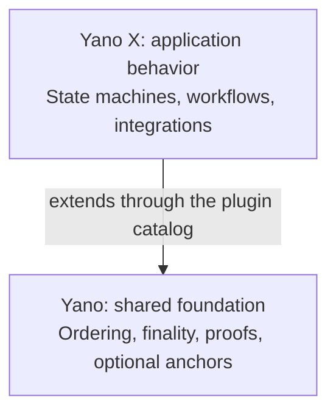

# Why Yano X

Choose Yano X when several organizations need shared records, workflows, or
integrations with independently verifiable results. Start with existing
capabilities, then add custom Java rules only where your application needs them.

Yano supplies the host. Yano X adds application behavior through JVM plugins
and reusable libraries. Their dependency direction is `yano-x → yano`.

## The boundary

| Concern | Owned by |
|---|---|
| Cardano L1 node, chain sync, chainstate | Yano |
| App-block ordering, membership, threshold finality certificates | Yano |
| Authenticated state, MPF, proof subjects, catch-up, replay | Yano |
| Anchoring to Cardano metadata or a threshold script | Yano |
| Effect runtime: gates, retries, receipts, result incorporation | Yano |
| Plugin SPI, manifest schema, catalog validation, lifecycle, isolation | Yano |
| `ordered-log` | Yano |
| Every other state machine | **Yano X** |
| Composite profiles and governed profile evolution | **Yano X** |
| Kafka / S3 / IPFS / Cardano-payment executors and sinks | **Yano X** |
| Evidence, Cardano History, eUTxO and ZK products | **Yano X** |
| Java client SDK, Spring Boot starter, testkits, App-Chain Studio | **Yano X** |
| The JVM distribution that ships all of the above pre-installed | **Yano X** |

## What "batteries included" actually means

For a first run, choose the [local showcase](/start-here/quickstart/).
Each release ships one archive, **`yano-x-jvm-<version>.zip`**: the standard
Yano JVM distribution with the Yano X plugin bundles already laid out, the
command-line and deployment tools, App-Chain Studio, the local showcase, and
identity manifests for both projects. The
[release download guide](/start-here/release-downloads/) shows where each part
lives. Operators who already run the matching Yano release can take bundles
from its `plugins/` directory.

The default `plugins/` directory is a deliberate, conflict-free **selection**,
not a copy of every published bundle. Alternative implementations that would
claim the same contribution live under `optional-plugins/` and are opted into
explicitly.

## Everything optional crosses the plugin boundary

This is the architectural rule that shapes the whole project: any behavior a
running node can independently select or manage is a plugin.

- Activation goes through `PluginProviderRegistry` and a schema-v1 plugin
  manifest.
- There is no raw `ServiceLoader` path, no direct host construction, no product
  switch in the host, and no product-specific host CDI or REST activation.
- Runtime plugins publish dependency-complete bundles, never embed host SPI
  classes, declare the Yano API major and min/max levels they are compatible
  with, and have bounded lifecycle cleanup.

Pure libraries, DTOs, clients, codecs, testkits, CLIs, on-chain validators, and
deterministic helpers are ordinary JARs — they only become plugins if the host
selects or manages them.

## JVM only, on purpose

Yano X is JVM-only. There are no GraalVM or native-image tasks, no reachability
metadata, and no native executables; the build gate `verifyJvmOnlyBuild`
rejects them. Yano's native image is core-only and starts with `ordered-log`,
but it does not load Yano X bundles — a native distribution reports a direct
incompatibility if you point a Yano X project at it.

A future native extension model would need its own architecture decision and a
build-time composition contract.

## Namespaces and compatibility

Use the namespace belonging to the artifact you consume:

- **Yano X uses Maven group `org.yanoproject.x` and Java packages
  `org.yanoproject.x.*`.** Yano host artifacts use `org.yanoproject` and host
  packages use `org.yanoproject.*`. Third-party Cardano libraries retain their
  own groups, including `com.bloxbean.cardano`.
- **The plugin directory property is `yano.plugins.directory`.** The older
  `yaci.plugins.directory` spelling is gone and must not come back.

## What you actually work with

Whatever you build, the surface is the same:

- `./yano.sh appchain …` — the public CLI, shipped inside the distribution.
  There is no separate `yano-x` executable.
- The REST API and SSE stream on each node.
- The Java client SDK (and a Spring Boot starter) for typed commands and proof
  verification.
- The [App-Chain Studio](/studio/) for building and exporting a blueprint
  visually.

Next: [Try the local showcase](/start-here/quickstart/), then
[choose a recipe](/recipes/choosing-a-recipe/).
