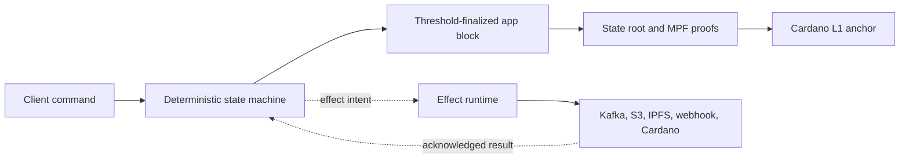
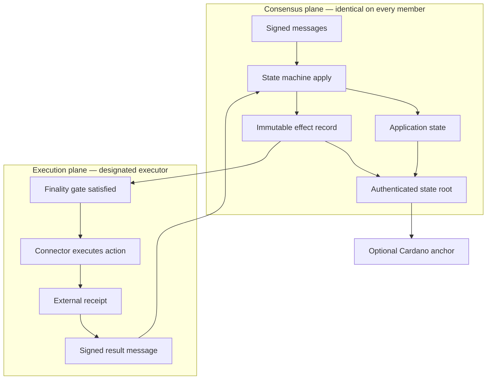
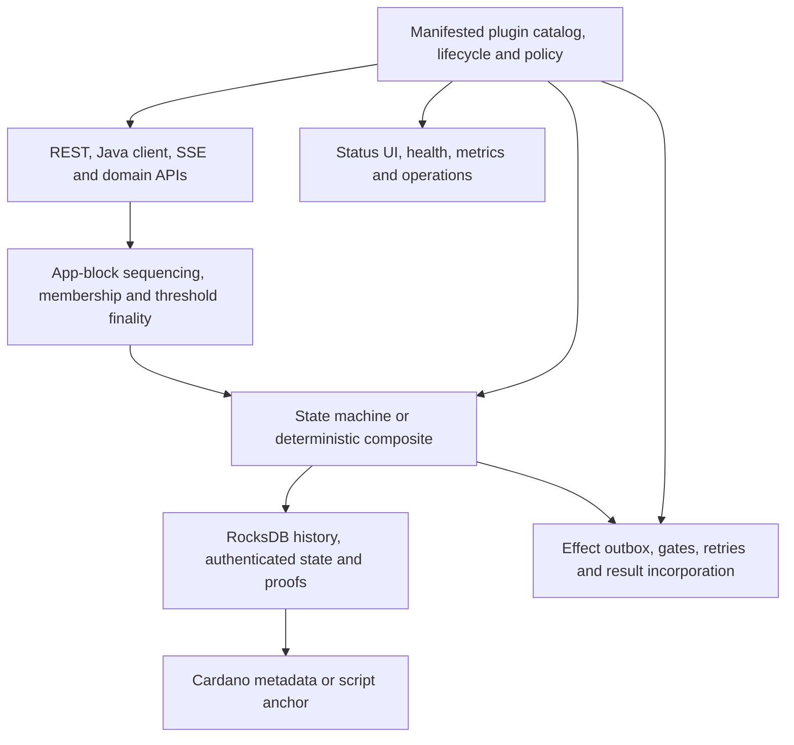
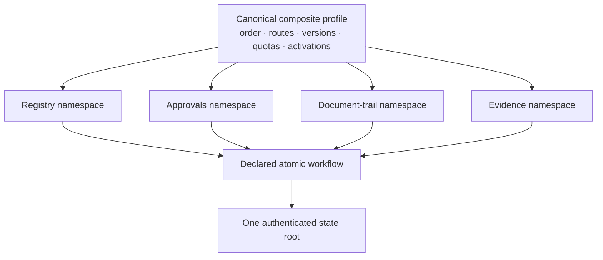

An app chain has four layers, and one safety boundary that matters more than
all the rest.

## The four layers

1. A member authenticates and relays a command.
2. The proposer orders commands into an app block.
3. A threshold of members signs the same block and state root.
4. State and effect intents become provable against that root.
5. An optional anchor settles the root on Cardano.
6. Effect executors act outside consensus and report bounded outcomes.

For role-aware workflows, the relay member and the business actor are separate
identities: a **node transports** a command, while an **actor signature
authorizes** its business meaning.

## The two-plane design

This is the boundary to internalize. Deterministic intent and
non-deterministic execution never touch.

The state machine records **what is authorized**. It never calls Kafka, IPFS,
S3, Cardano, an ERP, or a webhook during consensus. The effect runtime executes
the instruction later and reports the outcome back through the chain.

The guarantee is:

- **exactly-once** deterministic result incorporation; and
- **at-least-once** external execution.

Which is why every executor and every receiver must be idempotent under the
supplied idempotency identity. See [Effects](/concepts/effects/).

## The components

| Component | Responsibility | Key property |
|---|---|---|
| App-chain API and clients | Submit messages, inspect blocks, query state, stream finality, verify proofs. | Clients verify evidence rather than trust a response. |
| Proposer / sequencer | Orders accepted messages and proposes app blocks. | An ordering role only; it cannot force members to sign a wrong root. |
| Members | Validate, re-execute, vote, catch up, and retain finalized history. | Threshold control and independent verification. |
| State machine | Interprets application message bodies and writes deterministic state. | No wall clock, randomness, or external I/O. |
| Authenticated state | Commits state under one root and serves bounded proofs. | The same root on every member, and anchorable to Cardano. |
| Anchor subsystem | Publishes certified roots as Cardano metadata or a state-thread script UTxO. | Public L1 linkage without executing the application on L1. |
| Effect runtime | Discovers finalized effects, applies gates, retries, tracks receipts, reports results. | External failures neither fork nor block consensus. |
| Plugin catalog | Validates manifested bundles, dependencies, compatibility, policy, and lifecycle. | Extensibility stays explicit and auditable. |
| Operations surfaces | Status, health, Prometheus metrics, dashboards, admin and plugin operations. | Operators can distinguish intent, execution, incorporation, and anchoring. |

## Composite state machines

One app chain selects exactly **one** state machine. A deterministic composite
lets that single machine host several reusable capabilities behind one atomic
state root.

A composite profile explicitly declares component ids and versions,
deterministic application order, routed public topics, per-component quotas,
and activation heights. It is canonically encoded, committed to authenticated
state at height 1, and re-verified on every restart and every transition — so a
different component order or effective configuration is **detected** rather
than silently creating a different application.

Two modes:

- **Fixed** retains one immutable profile for the life of the chain.
- **Governed** commits an append-only chain of profile epochs. Operators
  package the reviewed current and dormant targets on every member first, then
  threshold-authorize one exact digest and a future activation height. Changing
  YAML or a JAR alone never changes consensus behavior.

Components cannot read or write sibling namespaces directly. Cross-component
changes go through a declared deterministic workflow.

## Data separation

Each node keeps three sibling stores, and conflating them is a correctness bug:

| Store | Contents | Authority |
|---|---|---|
| `chainstate/` | Cardano L1 state | Authoritative |
| `appchain-chainstate/` | App-chain state | Authoritative |
| `appchain-indexers/` | Local read indexes | Rebuildable, never authoritative |

Derived indexes must never advance beyond authoritative app-chain state, and
app-chain data must never be placed below L1 `chainstate`.

## Deployment shape

- **JVM:** copy a self-contained manifested bundle into every member's plugin
  directory, select it in configuration, restart. No Yano rebuild.
- **Native:** Yano's native image is core-only. Yano X extensions are JVM-only.
- **Multiple chains:** one node can host several independently configured app
  chains.
- **Executor placement:** effects may run on a designated member, a dedicated
  executor node, or through the external claim/report API. Type partitions and
  stable executor identities make ownership visible and recoverable.

## Where to go next

- [Consensus and finality](/concepts/consensus-and-finality/) — how a block
  becomes final.
- [State and proofs](/concepts/state-and-proofs/) — what a root commits to and
  how to verify it.
- [Effects](/concepts/effects/) — the execution plane in detail.
- [Determinism rules](/concepts/determinism-rules/) — what consensus code may
  not do.
