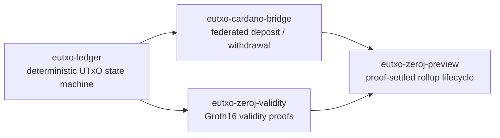

:::danger[Experimental — no real funds]
This family is `EXPERIMENTAL` and pre-production. It is **not** a Cardano
bridge product, a custody product, or a rollup you should put value into. The
ZK modules ship development Groth16 setup keys that are **test-only**;
production release is blocked until the governing ADR's ceremony, audit,
data-availability, and operational gates are satisfied.

Use a devnet or a Cardano test network with disposable keys.
:::

## What it is

A deterministic, Cardano-shaped eUTxO state machine that runs as an app-chain
capability. Its first milestone is a **no-real-funds experimental ledger** — a
place to execute Conway-shaped transactions against an app chain's threshold
finality and proofs rather than against L1.

Three layers, each optional on top of the previous:



## The virtual ledger

Select the `eutxo-ledger` recipe for a JVM project. It combines the reusable
`state:eutxo-ledger` engine with `profile:eutxo-plutus-v3` and the separate
`funding:eutxo-genesis` capability:

```yaml
yano:
  app-chain:
    chains:
      - chain-id: payments-eutxo
        state-machine: eutxo-ledger
        machines:
          eutxo:
            profile: yano-eutxo-v2-plutus-v3
            expected-profile-digest: 8cd4adb72def2c31dc8551a02f67429ea468bb2024dbe85a1dc7300590c9d1bf
            genesis:
              address: addr_test1...
              lovelace: 100000000
```

The profile commitment is SHA-256 over its canonical, versioned consensus
fields. **All members must use the same profile, digest, and genesis
allocation** — this is chain identity, not a tunable.

The ZeroJ development recipe uses `profile:eutxo-key-payments` instead, so
exactly one immutable ledger profile owns the consensus settings at a time.

## The capabilities

| Recipe | Availability | What it adds |
|---|---|---|
| `eutxo-ledger` | `FIRST_PARTY_OPTIONAL` | The deterministic UTxO ledger. |
| `eutxo-cardano-bridge` | `EXPERIMENTAL` | Federated deposit and withdrawal against Cardano. |
| `eutxo-zeroj-validity` | `EXPERIMENTAL` | ZeroJ Groth16 validity proofs over batches. |
| `eutxo-zeroj-preview` | `EXPERIMENTAL` | The full lifecycle: L1 deposit → L2 transaction → proof → root settlement → L1 withdrawal. |

The base eUTxO ledger has **no** ZeroJ or JuLC dependency and behaves exactly as
it does without them unless `machines.eutxo.validity.enabled=true`.

## The plugin-conflict rule

The standard eUTxO runtime and the eUTxO ZK runtime both intentionally provide
the `app-state-machine/eutxo-ledger` contribution. Exactly one may be installed.

That is why the ZK runtime ships under `optional-plugins/` rather than
`plugins/`. To switch:

```bash
# On EVERY member:
rm plugins/<standard-eutxo-ledger-bundle>.jar
cp optional-plugins/<eutxo-zk-runtime-bundle>.jar plugins/
tools/yano-plugins/bin/yano-plugins validate plugins/*.jar
```

Copying both into `plugins/` is a hard catalog error, and the node will refuse
to start rather than pick one.

## Indexing and lifecycle

The optional, provider-neutral validity lifecycle is projected by the common
eUTxO indexer. The indexer core has no ZeroJ dependency, and its projections are
**rebuildable read indexes** — they live in `appchain-indexers/` and must never
be treated as authoritative state or placed below L1 `chainstate`.

## Where to start

| Goal | Guide |
|---|---|
| The disposable three-scenario quick start | [eUTxO demos](https://github.com/bloxbean/yano-x/blob/main/ledgers/eutxo/DEMO.md) |
| Status and module verification | [ZK getting started](https://github.com/bloxbean/yano-x/blob/main/ledgers/eutxo-zk/GETTING_STARTED.md) |
| Deposit → L2 tx → proof → settlement → withdrawal | [Devnet walkthrough](https://github.com/bloxbean/yano-x/blob/main/ledgers/eutxo-zk/DEVNET_WALKTHROUGH.md) |
| Indexer API, SQLite, recovery, metrics | [Indexer operations](https://github.com/bloxbean/yano-x/blob/main/ledgers/eutxo/INDEXER_OPERATIONS.md) |
| The eUTxO product family overview | [`ledgers/eutxo/README.md`](https://github.com/bloxbean/yano-x/blob/main/ledgers/eutxo/README.md) |
| ZK milestone notes (Z0–Z4) | [`ledgers/eutxo-zk/`](https://github.com/bloxbean/yano-x/tree/main/ledgers/eutxo-zk) |

The demo guide is the shortest path — it covers the virtual ledger, the Cardano
bridge, and the optional ZeroJ proof experience without JShell or manual YAML
editing.
