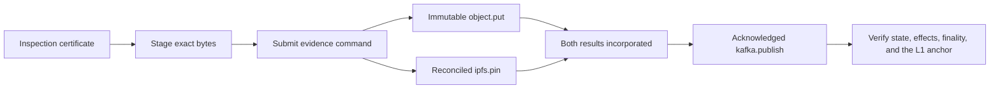

Evidence is the flagship Yano X product. It takes a document — a product
inspection certificate, a compliance attestation, a case file — and turns
publishing it into a provable, multi-party, externally-executed workflow.

## The flow



The chain records what was authorized. Object storage, IPFS, and Kafka are
executed by the [effect runtime](/concepts/effects/) after the finality gate,
and each result comes back on-chain and is incorporated exactly once.

## What it actually proves

The reference scenario verifies all of the following together:

- the exact archived object bytes, checksum, version, retention identity, and
  destination fingerprint;
- the exact IPFS CID, the retrieved bytes, and the configured pin state;
- the Kafka destination fingerprint, event bytes, partition, and offset;
- identical committed state across three app-chain members;
- state **and** effect inclusion proofs bound to the same root;
- threshold-signed finality evidence; and
- the Cardano script-anchor transaction, its state-thread token, and the
  canonical inline datum.

It also exercises executor failure after an external acknowledgement, fenced
failover, reconciliation without duplicate mutation, and restart with retained
state. The same scenario runs through Docker Compose and through ordinary host
processes.

:::caution[What it does not prove]
That the document's contents are true. Evidence proves that identified
participants approved these exact bytes, in this exact order, and that
connectors reported storing them. Domain validity stays with the domain.

It also does not prove **durable** availability. A pin or an object write is
proven at the moment it was reported; long-term retention is an operational
property you must monitor separately.
:::

## Two profiles

| Profile | Approvers | Use when |
|---|---|---|
| `evidence-v1-gated` (default) | Validator **members** | The organizations running nodes are the ones who approve. |
| `role-evidence` | Business **actors**, by role | The approvers are people — a QA manager, an auditor, a regulator — whose keys are not node keys. |

`evidence-v1-gated` combines registry, approvals, document trail, and
approval-coordinated evidence publication under one state root. A compatibility
`evidence-v1` preset keeps direct evidence commands for existing deployments.

`role-evidence` adds governed organizations, actor and key revisions, role
policies, organization-distinct quorums, and portable actor signatures. This is
the distinction between "a node transported this" and "a named person at a named
organization authorized this" — see
[Tutorial 5](/tutorials/05-domain-role-approvals/).

## The v1 domain contract

The wire contract is deliberately narrow and strictly canonical CBOR on topic
`evidence.command.v1`:

- canonical `SUBMIT`, `NOTIFY`, and `REPUBLISH` commands;
- immutable head, version-record, effect-reference, and terminal-result codecs;
- canonical `evidence.available` Kafka event bytes;
- `evidence/get` request and response contracts that return the exact proven
  state keys and values;
- domain-separated state keys, effect scopes, and Kafka keys; and
- deterministic status derivation with **fail-closed** connector receipt checks.

The wire schema version is separate from the monotonically increasing business
version. Immutable version records sit behind a small head record, and business
status is derived from authenticated connector results rather than asserted.

## Modules

| Artifact | Repo path | Role |
|---|---|---|
| `yano-x-evidence-contracts` | `products/evidence/contracts` | No-SPI canonical codecs, usable off-chain. |
| `yano-x-evidence-registry` | `products/evidence/registry` | The deterministic state machine, its provider, and a bundle-owned read-only domain API. |
| `yano-x-evidence-profile` | `products/evidence/profile` | The `evidence-v1-gated` and `role-evidence` composite profiles. |
| `yano-x-evidence-client` | `products/evidence/client` | Typed client for commands and proof-carrying reads. |

## Run it

The `evidence-ledger` recipe is the configuration-only path:

```bash
./yano.sh appchain init --non-interactive \
  --recipe evidence-ledger --network devnet --members 3 --runtime jvm \
  --output evidence-chain
```

For the complete connector demo — real object storage, a Kubo IPFS node, and
Kafka — follow [Tutorial 4](/tutorials/04-evidence-publication/). It needs
Docker Desktop.

Deployments additionally need the release-matched
[optional connector bundles](https://github.com/bloxbean/yano-x/blob/main/docs/appchain/OPTIONAL_CONNECTORS.md)
installed in `plugins/` on every executor node, plus the external services
themselves.

## Deeper reading

- [Tutorial 4 — evidence publication](/tutorials/04-evidence-publication/)
- [Tutorial 5 — domain-role approvals](/tutorials/05-domain-role-approvals/)
- [Evidence chain demo](https://github.com/bloxbean/yano-x/blob/main/docs/EVIDENCE_CHAIN_DEMO.md)
  — the full scripted scenario and its acceptance checks.
- [Domain actors and role-aware approvals](https://github.com/bloxbean/yano-x/blob/main/docs/APP_CHAIN_DOMAIN_ROLES.md)
- [Profile governance runbook](https://github.com/bloxbean/yano-x/blob/main/docs/APP_CHAIN_PROFILE_GOVERNANCE.md)
