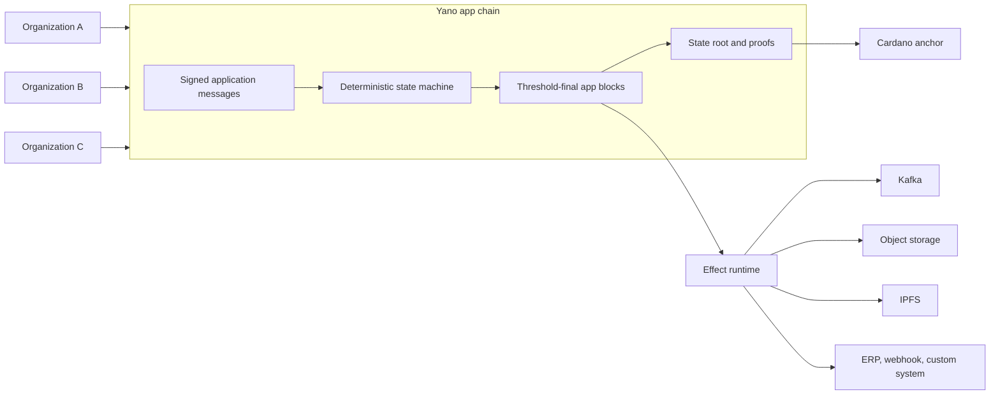
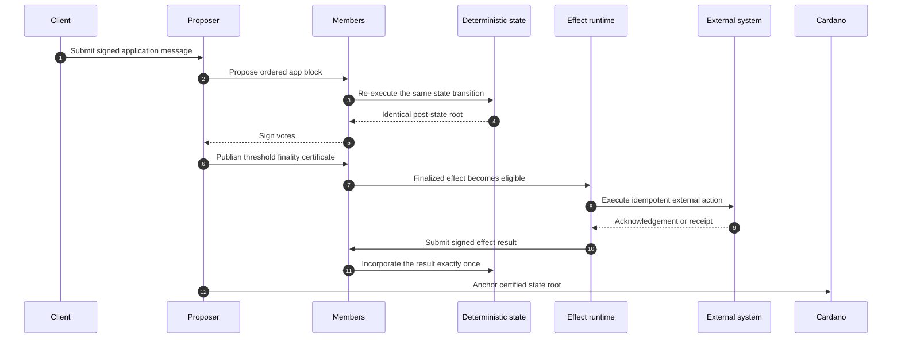

An **app chain** is an application-specific, replicated ledger that a group of
organizations runs together. Members agree on the order of application
messages, execute the same deterministic state machine over them, and each
independently derive the same authenticated state root. Supported state claims can then be proved against that root, and the root
can optionally be anchored on Cardano.

The shortest description:

> A programmable, multi-party application ledger with deterministic state,
> threshold finality, proofs, Cardano anchoring, and controlled external
> actions.

## The problem it solves

Many business processes span several organizations and systems, and today they
usually look like this:

- each participant keeps its own database;
- one operator controls the shared API or message broker;
- audits reconstruct history after the fact;
- external actions are hard to tie back to an agreed business decision; and
- putting every application event directly on a public blockchain is too slow,
  too costly, too public, or too inflexible.

An app chain gives the participants a shared application layer without turning
every business operation into a Cardano transaction.

The app chain does not replace Cardano. It supplies application-specific
execution and coordination; Cardano supplies an independently observable
settlement and timestamping layer for the state the app chain commits to.

## What makes it an app chain rather than a shared database

| Characteristic | What it means | Why it matters |
|---|---|---|
| Signed participation | Members and messages have cryptographic identities. | The system knows who submitted and who approved an action. |
| Deterministic execution | Every member applies the same messages through the same state machine. | Honest members derive the same state root byte for byte. |
| Threshold finality | A block is final only after the configured member threshold signs it. | No single database or broker operator decides history. |
| Hash-linked blocks | Finalized blocks commit to prior history. | Reordering or rewriting history is detectable. |
| Provable state | State lives in an MPF trie with inclusion and exclusion proofs. | A client verifies a record against a root without trusting one node. |
| Cardano anchoring | A finalized root can be written to a metadata or script anchor. | Auditors can bind app-chain evidence to public L1 history. |
| Deterministic effects | External work is authorized by emitting immutable effect records. | Network I/O never contaminates consensus execution. |
| Catch-up and recovery | Restarted or joining members fetch and independently verify history. | Recovery does not require trusting a database copy. |
| Plugins and presets | State machines, executors, sinks, APIs, and queries are extensible. | A domain can evolve without forking the consensus framework. |

## The end-to-end flow

1. A client submits a signed message to an application topic.
2. The proposer orders accepted messages into an app block.
3. Every member validates the block and independently executes the state
   machine.
4. Members sign only the state root they derived themselves.
5. The block is final once the configured signature threshold is met.
6. Clients query state and request proofs bound to that finalized root.
7. If the transition emitted an effect, an executor performs it once its
   finality gate is satisfied.
8. For tracked effects, the signed result returns through the chain and is
   incorporated deterministically.
9. An optional Cardano anchor commits the certified root to L1.

The trust model is **fail closed**. Envelope signatures, membership, vote
signatures, and certificate thresholds are verified on every node, always. A
non-member's messages are dropped, a non-sequencer's blocks are never
finalized, and a tampered block fails the state-root re-execution check.

## Vocabulary

| Term | Meaning |
|---|---|
| **Chain id** | The name of your app chain. The same members may run multiple independent chain ids. A node can host several chains. |
| **Member** | A participant identified by an Ed25519 public key. Only members' messages are accepted, and members co-sign blocks. The v1 profile supports at most 32 members. |
| **Proposer / sequencer** | The member that orders messages into blocks — either a configured fixed proposer, or the member deterministically selected for the current L1-slot window in rotating mode. |
| **Threshold** | How many member signatures a finality certificate requires. |
| **App message** | An envelope with an opaque, sender-signed body. The framework never parses the body; only the state machine interprets it. |
| **Topic** | An optional sub-stream label inside a chain, for routing and filtering. |
| **App block** | An ordered batch of messages plus the post-state MPF root and a finality certificate, hash-linked to the previous block. |
| **State root** | The Merkle Patricia Forestry root after applying a block. Identical on every member, anchorable to L1, and provable. |
| **State machine** | The only component that interprets message bodies. |
| **Effect** | An immutable record emitted by a transition, authorizing external work that an executor performs after finality. |
| **Anchor leader** | The single node that builds, pays for, and submits anchor transactions. Its powers depend on anchor mode; script advances require member co-signatures. |

## When an app chain is the right answer

An app chain is useful when several of these needs apply:

- several organizations must agree on the same sequence of application records;
- no single participant should own the authoritative database;
- someone will later need to prove a specific record, not merely be told about
  it;
- the volume, privacy, or cost profile makes putting each event directly on a
  public chain impractical; and
- some external systems must act on decisions, but only after those decisions
  are final.

It is **not** the right answer for a single-organization application with no
external verifier, for high-frequency data with no dispute surface, or for
anything that genuinely needs permissionless participation.

## Where Yano and Yano X fit

Yano is the host: a Cardano data node with a minimal app-chain runtime,
consensus, proofs, anchoring, the effect system, the plugin SPI, and
`ordered-log` as its only built-in state machine.

**Yano X** is the extension ecosystem on top: the stock state machines, the
composition framework, connectors, products, SDKs, tooling, and the
batteries-included JVM distribution.

Next: [Why Yano X](/start-here/why-yano-x/).
