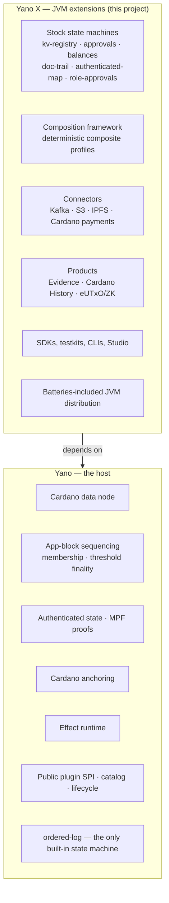

Yano and Yano X are two repositories with one strict dependency direction:
`yano-x → yano`. Understanding which side owns what is the single most useful
thing to know before you start.

## The boundary

| Concern | Owned by |
|---|---|
| Cardano L1 node, chain sync, chainstate | Yano |
| App-block ordering, membership, threshold finality certificates | Yano |
| Authenticated state, MPF, proof subjects, catch-up, replay | Yano |
| Anchoring to Cardano metadata or a threshold script | Yano |
| Effect runtime: gates, retries, receipts, result incorporation | Yano |
| Plugin SPI, manifest schema, catalog validation, lifecycle, isolation | Yano |
| `ordered-log` | Yano |
| Every other state machine | **Yano X** |
| Composite profiles and governed profile evolution | **Yano X** |
| Kafka / S3 / IPFS / Cardano-payment executors and sinks | **Yano X** |
| Evidence, Cardano History, eUTxO and ZK products | **Yano X** |
| Java client SDK, Spring Boot starter, testkits, App-Chain Studio | **Yano X** |
| The JVM distribution that ships all of the above pre-installed | **Yano X** |

## What "batteries included" actually means

Building Yano X produces two archives:

- **`yano-x-jvm-<version>.zip`** — the standard Yano JVM distribution with the
  Yano X plugin bundles already laid out, plus identity manifests for both
  projects. This is what you run.
- **`yano-x-plugin-pack-<version>.zip`** — just the plugin bundles and a
  checksummed manifest, for adding Yano X to a Yano distribution you already
  operate.

The default `plugins/` directory is a deliberate, conflict-free **selection**,
not a copy of every published bundle. Alternative implementations that would
claim the same contribution live under `optional-plugins/` and are opted into
explicitly.

## Everything optional crosses the plugin boundary

This is the architectural rule that shapes the whole project: any behavior a
running node can independently select or manage is a plugin.

- Activation goes through `PluginProviderRegistry` and a schema-v1 plugin
  manifest.
- There is no raw `ServiceLoader` path, no direct host construction, no product
  switch in the host, and no product-specific host CDI or REST activation.
- Runtime plugins publish dependency-complete bundles, never embed host SPI
  classes, declare the Yano API major and min/max levels they are compatible
  with, and have bounded lifecycle cleanup.

Pure libraries, DTOs, clients, codecs, testkits, CLIs, on-chain validators, and
deterministic helpers are ordinary JARs — they only become plugins if the host
selects or manages them.

## JVM only, on purpose

Yano X is JVM-only. There are no GraalVM or native-image tasks, no reachability
metadata, and no native executables; the build gate `verifyJvmOnlyBuild`
rejects them. Yano's native image is core-only and starts with `ordered-log`,
but it does not load Yano X bundles — a native distribution reports a direct
incompatibility if you point a Yano X project at it.

A future native extension model would need its own architecture decision and a
build-time composition contract.

## Two names that look like mistakes but are not

Two invariants surprise almost everyone, including coding agents:

- **Java packages stay `com.bloxbean.cardano.yano.appchain.*`** while
  repository and artifact names are `yano-x`. The repository split deliberately
  did not rename the app-chain technical domain.
- **The plugin directory property is `yano.plugins.directory`.** The older
  `yaci.plugins.directory` spelling is gone and must not come back.

## What you actually work with

Whatever you build, the surface is the same:

- `./yano.sh appchain …` — the public CLI, shipped inside the distribution.
  There is no separate `yano-x` executable.
- The REST API and SSE stream on each node.
- The Java client SDK (and a Spring Boot starter) for typed commands and proof
  verification.
- The [App-Chain Studio](/studio/) for building and exporting a blueprint
  visually.

Next: [Build from source](/start-here/build-from-source/).
